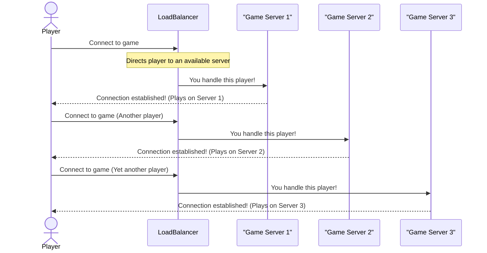

# Chapter 1: Scalability

Imagine you've launched a fantastic new online game called "Cloud Adventure." At first, it's just you and a few friends playing, and everything runs smoothly on a single, basic computer server. But then, the game gets featured by a popular streamer! Suddenly, thousands, then tens of thousands, of people are trying to play "Cloud Adventure" all at once.

What happens? Your single server gets overwhelmed. The game starts to lag, characters freeze, messages don't send, and eventually, the server might even crash. Players get frustrated and leave. This is a common problem for any successful application: **how do you make sure your system can handle more and more users or data without falling apart?** The answer is **Scalability**.

Scalability is all about designing your system so it can grow and handle an increasing amount of work, users, or data without losing its speed or performance. Think of it like making sure your game can still offer a smooth experience, whether there are 10 players or 10 million players.

## Two Ways to Scale

There are two main ways to make your system more scalable, just like there are two main ways to expand a small road to handle more cars:

### 1. Vertical Scaling (Scaling Up)

Imagine your game server is like a single, basic car. When more people want to play, you might decide to "vertically scale" by upgrading that single car. You'd replace its engine with a super-powerful one, add more seats, and give it faster wheels. In the world of computers, this means:

*   **Adding more resources to a single machine.**
*   **Examples:** Upgrading the server's Central Processing Unit (CPU) to a faster one, adding more Random Access Memory (RAM), or increasing the storage space (like getting a bigger hard drive).

This is often the simplest approach initially. You don't have to manage multiple cars; you just make your one car much, much stronger.

```python
# Vertical Scaling: Making one server more powerful
server_speed_gb = 8 # GB of RAM
server_cpu_cores = 2 # CPU cores
print(f"Initial server: {server_speed_gb}GB RAM, {server_cpu_cores} cores")

# Upgrade the server!
server_speed_gb += 8 # Add more RAM
server_cpu_cores += 2 # Add more CPU cores
print(f"Upgraded server: {server_speed_gb}GB RAM, {server_cpu_cores} cores")
# Output:
# Initial server: 8GB RAM, 2 cores
# Upgraded server: 16GB RAM, 4 cores
```
In this simple example, we're conceptually "upgrading" a single server's resources. The server itself doesn't change, but its capabilities increase.

### 2. Horizontal Scaling (Scaling Out)

What happens when you can't upgrade your car any further? There's a limit to how powerful a single car can be. This is where "horizontal scaling" comes in. Instead of one super-car, you get *many* standard cars. If 10,000 people want to play "Cloud Adventure," you add 99 more servers, so you have 100 servers working together, each handling a smaller piece of the player load.

*   **Adding more machines (servers) to your system.**
*   **Examples:** Instead of one powerful game server, you deploy 10 smaller, identical game servers. When a player connects, they are directed to one of the available servers.

Horizontal scaling offers almost limitless growth potential. If one server breaks, the others can pick up the slack, making the system more robust.

```python
# Horizontal Scaling: Adding more identical servers
num_game_servers = 1
active_servers = ["game_server_A"]
print(f"Initial game servers: {num_game_servers} ({active_servers})")

# Player demand increases, so we add another server!
num_game_servers += 1
active_servers.append("game_server_B")
print(f"After scaling: {num_game_servers} ({active_servers})")
# Output:
# Initial game servers: 1 (['game_server_A'])
# After scaling: 2 (['game_server_A', 'game_server_B'])
```
Here, we simply increase the *number* of servers to handle more players. Each server might be standard, but together they handle a much larger load.

## How Scalability Helps "Cloud Adventure"

For our "Cloud Adventure" game, if we saw a sudden jump from 100 to 500 players, we might try **vertical scaling** first. We'd rent a more powerful server with more RAM and a faster CPU to handle the increased calculations and player connections. This is quicker to implement.

However, if "Cloud Adventure" becomes a global phenomenon with millions of players, **vertical scaling** will hit a wall. You can't buy an infinitely powerful computer! At that point, we absolutely need **horizontal scaling**. We'd set up hundreds or thousands of servers, and crucially, we'd use something called a **Load Balancer** (which you'll learn about in [Load Balancing](10_load_balancing_.md)) to cleverly distribute all those players across the available servers. This ensures no single server gets overloaded, and players get a smooth experience.

### Under the Hood: Distributing the Load

Let's see how horizontal scaling might look for "Cloud Adventure" when a new player tries to join:


In this diagram, the `LoadBalancer` acts like a traffic cop, making sure incoming `Player` connections are spread out among the available `GameServer`s. If `GameServer1` becomes too busy, the `LoadBalancer` can direct new players to `GameServer2` or `GameServer3` instead. If we need to handle even more players, we simply add another `GameServer`.

## Vertical vs. Horizontal Scaling: A Quick Comparison

It's important to understand the pros and cons of each approach:

| Feature            | Vertical Scaling (Scale Up)               | Horizontal Scaling (Scale Out)           |
| :----------------- | :---------------------------------------- | :--------------------------------------- |
| **Method**         | Add more power to *one* existing machine  | Add *more* machines                     |
| **Example**        | Faster CPU, more RAM for a single server  | More servers, more database instances  |
| **Setup Cost**     | Can be expensive for top-tier hardware    | Often cheaper using many standard machines |
| **Complexity**     | Simpler to manage (fewer moving parts)    | More complex (coordinating multiple machines, needs [Load Balancing](10_load_balancing_.md)) |
| **Maximum Limit**  | Limited by the ultimate power of one machine | Potentially limitless (just keep adding machines) |
| **Resilience**     | Single point of failure (if that one machine fails, the whole system might go down) | Higher (if one machine fails, others can take over with minimal impact) |

## Conclusion

Scalability is a fundamental concept for any successful software system. It's the ability to grow gracefully and handle increasing demand without performance issues. You learned about two key ways to achieve this: **vertical scaling** (making a single resource stronger) and **horizontal scaling** (adding more resources). While vertical scaling is simpler, horizontal scaling offers far greater potential for growth and resilience, which is crucial for modern, large-scale applications.

In the next chapter, we'll dive into [Layered Architecture](02_layered_architecture_.md), which is a common way to organize your application's components. A well-organized architecture is often the first step towards building a system that can be easily scaled!
