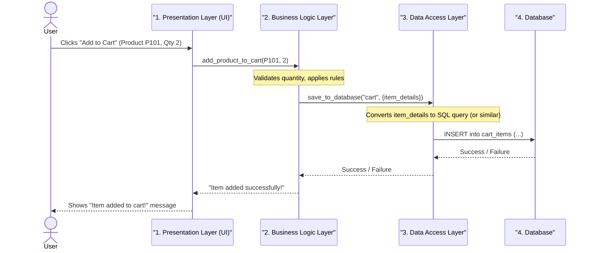

# Chapter 2: Layered Architecture

In the last chapter, we talked about [Scalability](01_scalability_.md) – how to make sure your application can handle more users and data as it grows. Imagine your "Cloud Adventure" game became so popular that you needed to add new features all the time, like new quests, items, or social interactions.

If all the code for everything – showing graphics, saving player scores, managing inventory, processing new quests – was just mashed together in one giant file or section, what would happen? It would become a huge, tangled mess! Finding a bug would be like searching for a needle in a haystack. Adding a new feature might accidentally break something else entirely. This "tangled mess" is a common problem for growing applications.

So, how do we keep our code organized and manageable, even as our application gets bigger and more complex? The answer is **Layered Architecture**.

## What is Layered Architecture?

Layered Architecture is a way to organize your application's code into distinct, horizontal groups called **layers**. Think of it like a multi-story building, where each floor has a specific job:

*   **Ground Floor (Lobby):** Deals with visitors coming in and out.
*   **Office Floors:** Where the main work of the business happens.
*   **Basement (Storage):** Where important documents and resources are kept safe.

Just like in a building, each layer in an application has a specific responsibility, and it typically interacts only with the layers directly above or below it. This clear structure makes the entire system easier to understand, manage, and modify.

### The Three Most Common Layers

While you can have many layers, most applications using a Layered Architecture often feature these three core layers:

1.  **Presentation Layer (UI Layer):** This is the "face" of your application.
    *   **Responsibility:** Showing information to the user and taking input from them. This is everything the user *sees* and *interacts* with.
    *   **Examples:** Website pages, mobile app screens, desktop application windows.
    *   **Analogy:** The windows, doors, and reception desk of our multi-story building. It's how people interact with the building.

    ```python
    # presentation_layer.py (Simplified)
    def display_product_page(product_info):
        """Shows product details to the user."""
        print(f"--- Product Page ---")
        print(f"Name: {product_info['name']}")
        print(f"Price: ${product_info['price']:.2f}")
        print(f"Description: {product_info['description']}")
        print(f"--------------------")

    def get_user_input(prompt):
        """Gets input from the user."""
        return input(prompt)

    # What the user sees and types.
    ```
    This `Presentation Layer` code is responsible for displaying product details to the user and getting input from them, like what they want to buy. It doesn't know *how* to get the product information or save an order; it just shows things.

2.  **Business Logic Layer (Application Layer / Service Layer):** This is the "brain" or "engine" of your application.
    *   **Responsibility:** Contains all the core rules, calculations, and operations that define what your application *does*. It tells the application *how* to respond to user actions.
    *   **Examples:** "Add an item to a shopping cart," "process an order," "calculate discounts," "validate user input."
    *   **Analogy:** The offices and meeting rooms where the actual business decisions and work happen.

    ```python
    # business_logic_layer.py (Simplified)
    import data_access_layer

    def add_product_to_cart(user_id, product_id, quantity):
        """Handles the logic for adding a product to a user's cart."""
        if quantity <= 0:
            return False, "Quantity must be positive."

        # This layer decides *what* to save
        # and then asks the Data Access Layer to save it.
        success = data_access_layer.save_to_database("cart", {'user_id': user_id, 'product_id': product_id, 'quantity': quantity})
        if success:
            return True, "Product added to cart successfully!"
        else:
            return False, "Failed to add product to cart."

    # This layer has the 'rules' for adding items.
    ```
    The `Business Logic Layer` contains the rules, like checking if the quantity is valid. It decides *what* needs to be done (e.g., save an item to a cart) and then delegates the actual saving to the `Data Access Layer`.

3.  **Data Access Layer (Persistence Layer):** This layer handles all communication with your data storage.
    *   **Responsibility:** Saving data to and retrieving data from databases, files, or other storage systems. It shields the other layers from the complexities of *how* data is stored.
    *   **Examples:** Connecting to a SQL database, writing to a file, interacting with a cloud storage service.
    *   **Analogy:** The basement or archives where records are stored and retrieved. The office workers (business logic) don't need to know the exact filing system; they just ask the archive staff (data access) to get or store a document.

    ```python
    # data_access_layer.py (Simplified)
    # In a real app, this would connect to a database like MySQL, PostgreSQL, etc.
    _database = {} # A simple dictionary pretending to be a database for now

    def save_to_database(collection_name, data):
        """Saves data to our 'database'."""
        if collection_name not in _database:
            _database[collection_name] = []
        _database[collection_name].append(data)
        print(f"DEBUG: Saved {data} to '{collection_name}' in database.")
        return True

    def get_from_database(collection_name, query_key, query_value):
        """Retrieves data from our 'database'."""
        if collection_name in _database:
            for item in _database[collection_name]:
                if item.get(query_key) == query_value:
                    return item
        return None

    # This layer knows how to read/write to storage.
    ```
    The `Data Access Layer` is the only part that "knows" how to talk to our simple `_database` (which is just a dictionary here). It handles saving and retrieving information without the other layers needing to know the technical details.

## How it All Works Together: An Online Store Example

Let's imagine a customer wants to add a product to their shopping cart in our online store:

1.  **User Action:** The customer clicks an "Add to Cart" button on the website.
2.  **Presentation Layer:** The website (Presentation Layer) receives this click. It gathers the product ID and quantity from the page.
3.  **Business Logic Layer:** The Presentation Layer then calls a function in the Business Logic Layer, something like `add_product_to_cart(user_id, product_id, quantity)`.
4.  **Business Logic Layer:** This layer checks if the quantity is valid, maybe applies some business rules (e.g., "maximum 10 of this item per customer"). If everything looks good, it knows that this action requires saving data.
5.  **Data Access Layer:** The Business Logic Layer then calls a function in the Data Access Layer, like `save_to_database("cart_items", {item_details})`.
6.  **Data Access Layer:** This layer takes the item details and performs the actual operation of inserting this data into the database.
7.  **Response:** The Data Access Layer sends back a success/failure message to the Business Logic Layer, which then sends it back to the Presentation Layer, which finally tells the user (e.g., "Item added to cart!" or "Error: Invalid quantity").

Let's see this flow with some simple code combining our layers:

```python
# main_app.py - How the layers interact
import presentation_layer
import business_logic_layer
import data_access_layer

# 1. Simulate setting up a product (via Data Access, often done by admin tools)
# For simplicity, we directly add a product here for demonstration.
data_access_layer._database["products"] = [
    {"id": "P101", "name": "Fancy Gadget", "price": 99.99, "description": "A very fancy gadget."},
    {"id": "P102", "name": "Basic Widget", "price": 19.99, "description": "A simple, useful widget."}
]

# 2. Simulate user browsing a product page
product = data_access_layer.get_from_database("products", "id", "P101")
if product:
    presentation_layer.display_product_page(product)

# 3. Simulate user adding product to cart
user_id = "user_A"
product_to_add = "P101"
quantity_to_add = 2

print("\n--- User attempts to add product to cart ---")
success, message = business_logic_layer.add_product_to_cart(user_id, product_to_add, quantity_to_add)
print(f"Result for adding P101 (quantity {quantity_to_add}): {message}")

# 4. Simulate adding with bad quantity
bad_quantity = 0
print("\n--- User attempts to add product with bad quantity ---")
success, message = business_logic_layer.add_product_to_cart(user_id, product_to_add, bad_quantity)
print(f"Result for adding P101 (quantity {bad_quantity}): {message}")

# Expected Output (conceptual, with debug messages from data_access_layer):
# --- Product Page ---
# Name: Fancy Gadget
# Price: $99.99
# Description: A very fancy gadget.
# --------------------

# --- User attempts to add product to cart ---
# DEBUG: Saved {'user_id': 'user_A', 'product_id': 'P101', 'quantity': 2} to 'cart' in database.
# Result for adding P101 (quantity 2): Product added to cart successfully!

# --- User attempts to add product with bad quantity ---
# Result for adding P101 (quantity 0): Quantity must be positive.
```
This `main_app.py` ties everything together. It first uses the `Data Access Layer` to pretend a product exists. Then, it uses the `Presentation Layer` to show that product. Finally, it uses the `Business Logic Layer` to handle adding an item to the cart, which in turn uses the `Data Access Layer` to save the information. Notice how each layer only talks to its direct neighbors or to `main_app` which coordinates them.

## Under the Hood: The Flow of a Request

Let's visualize the "Add to Cart" process using a simple diagram:


This diagram clearly shows the flow. The `User` interacts with the `Presentation Layer`, which then asks the `Business Logic Layer` to perform the core action. The `Business Logic Layer` relies on the `Data Access Layer` to handle any database interactions, and finally, responses travel back up the layers to the user.

## Why Use Layered Architecture?

Layered Architecture offers several important benefits:

*   **Separation of Concerns:** Each layer has a specific job and doesn't worry about the jobs of other layers. The UI doesn't care how data is saved; it just asks the Business Logic layer. The Business Logic layer doesn't care about database details; it just tells the Data Access layer what to save. This keeps things neat.
*   **Easier to Understand:** With clear boundaries, new developers (or even you months later!) can quickly grasp where specific code lives and what its purpose is.
*   **Easier to Maintain and Test:** If you want to change how you display products (e.g., update website design), you mostly work within the Presentation Layer, without fear of breaking the database logic. If you want to change how orders are saved (e.g., switch from one database to another), you primarily modify the Data Access Layer. This also makes testing individual parts much simpler.
*   **Improved Scalability (Foundational):** While Layered Architecture itself isn't a direct scaling solution, it's a crucial first step. If your Presentation Layer becomes too busy, you *could* potentially run multiple copies of just that layer, while the Business Logic and Data Access layers remain separate. This paves the way for more advanced scaling strategies, which you'll explore in future chapters.

## Conclusion

Layered Architecture is a fundamental pattern for organizing your application's code into logical, distinct layers, each with a specific responsibility. By separating concerns into layers like Presentation, Business Logic, and Data Access, you create a system that is easier to understand, maintain, test, and evolve. It's like building a well-designed house – each room (or layer) has a clear purpose, making the whole structure functional and resilient.

This organized approach is an essential foundation for building robust applications that can grow. In our next chapter, we'll look at [Microservices Architecture](03_microservices_architecture_.md), which takes the idea of "separation" even further, allowing different parts of your application to run and scale completely independently!
