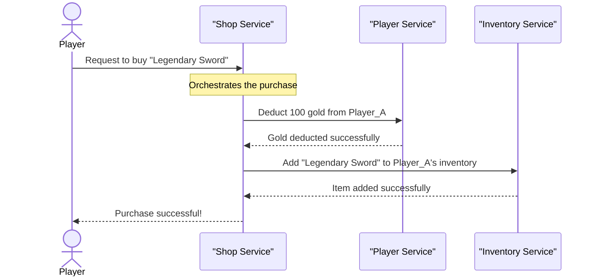

# Chapter 3: Microservices Architecture

In our journey to become awesome architects, we've already learned about [Scalability](01_scalability_.md) – how to make our applications grow – and [Layered Architecture](02_layered_architecture_.md), which helps organize code within a single application. Layered Architecture gives each part of our application a clear job, making it easier to manage. But what if your "Cloud Adventure" game becomes *so* incredibly popular and complex that even a well-layered application starts to feel like a single, giant, hard-to-change block?

Imagine "Cloud Adventure" has grown to include:
*   A complex player profile system.
*   An elaborate inventory and item crafting system.
*   Hundreds of quests with intricate logic.
*   A real-time chat and social network.
*   An in-game shop with dynamic pricing.

If all these different parts are still bundled together as one big program, even with layers, updating just the shop's pricing logic might require re-deploying the entire game, potentially affecting player profiles or quest progress. If the inventory system suddenly gets super busy, the *entire* game might slow down because all systems share the same resources. This is where **Microservices Architecture** comes in, taking the idea of "separation" to a whole new level!

## What is Microservices Architecture?

**Microservices Architecture** is an architectural pattern that breaks down a large application into many tiny, independent services. Each of these services is a complete, self-contained program that focuses on doing one specific job very, very well.

Think of it like this: Instead of building one giant department store (a single, monolithic application) that handles *everything* (clothing, electronics, groceries, banking, repairs), you build a bustling city with many specialized, independent shops.

*   There's a dedicated "Clothing Boutique" (Player Profile Service).
*   A separate "Electronics Store" (Inventory Service).
*   A "Grocery Market" (Quest Management Service).
*   A "Bank" (Payment Service).

Each shop:
*   **Has its own team:** A small group of developers can completely own and understand one specific service.
*   **Runs independently:** If the "Clothing Boutique" needs an update, you don't shut down the entire city; you just update that one shop.
*   **Can scale independently:** If the "Electronics Store" is suddenly swamped with customers, you can add more cashiers or expand just that store, without affecting the "Grocery Market."
*   **Communicates with others:** Shops still need to interact (e.g., the "Clothing Boutique" might ask the "Bank" to process a payment). They do this using well-defined "network APIs" (like sending formal requests between businesses).

This makes the overall system much more flexible, easier to manage, and more resilient.

## Key Ideas Behind Microservices

Let's break down the core principles that make microservices work:

### 1. Small, Independent Services

Each microservice is designed to do one thing and do it well. For our "Cloud Adventure" game:

*   **Player Service:** Manages player accounts, login, basic profiles.
*   **Inventory Service:** Manages what items players own, item properties.
*   **Quest Service:** Handles quest progress, objectives, rewards.
*   **Shop Service:** Manages in-game items for sale, prices, purchasing.

This means the code for each service is much smaller and easier to understand than the code for a giant all-in-one application.

### 2. Independent Development and Deployment

Because services are small and independent, different teams can work on different services at the same time without stepping on each other's toes.

More importantly, each service can be **deployed (released)** on its own. If the "Shop Service" needs a new feature, you only deploy the updated "Shop Service." The "Player Service" and "Quest Service" continue running undisturbed. This means faster updates and less risk.

### 3. Independent Scaling

This is a huge benefit for [Scalability](01_scalability_.md)! If the "Inventory Service" is getting hammered because lots of players are crafting new items, you can add more servers *just for the Inventory Service*. The "Quest Service," which might not be as busy, doesn't need extra resources. This is a form of **horizontal scaling**, but applied to individual parts of your application, making it much more efficient.

### 4. Communication via Network APIs

Since microservices run independently (often on different servers), they can't just call functions directly in each other's code. Instead, they communicate by sending messages over the network, typically using **APIs (Application Programming Interfaces)**. These APIs are like a contract between services, defining how they can ask each other for information or actions. (You'll learn much more about [API Gateway](04_api_gateway_.md) in the next chapter!)

## Solving the "Cloud Adventure" Item Purchase Use Case

Let's revisit our "Cloud Adventure" game and see how a microservices approach would handle a player buying an item from the in-game shop.

Instead of one giant "game logic" component, we now have specialized services:

*   `Player Service`: To deduct currency from the player.
*   `Inventory Service`: To add the purchased item to the player's inventory.
*   `Shop Service`: To orchestrate the purchase, check item availability, and coordinate with other services.

Here's a simplified look at how these services might interact (remember, in a real system, these would be separate programs communicating over a network, not just Python functions in the same file):

```python
# --- player_service.py (Conceptual) ---
def deduct_currency(player_id, amount):
    """Simulates deducting currency from a player's account."""
    print(f"Player Service: Deducting {amount} from player {player_id}.")
    # In a real service, this would update a player's balance in a database.
    return True # Assume success for simplicity

# --- inventory_service.py (Conceptual) ---
def add_item_to_inventory(player_id, item_id):
    """Simulates adding an item to a player's inventory."""
    print(f"Inventory Service: Adding item {item_id} to player {player_id}'s inventory.")
    # In a real service, this would insert an item into a database.
    return True # Assume success for simplicity

# --- shop_service.py (Conceptual) ---
# This service coordinates the purchase flow
# In a real app, this would use network calls to communicate with other services.

# Let's import the conceptual services as if they were remote calls.
# In reality, these would be HTTP requests or message queue interactions.
from player_service import deduct_currency
from inventory_service import add_item_to_inventory

def buy_item(player_id, item_id, price):
    """Handles the logic for a player buying an item."""
    print(f"\nShop Service: Player {player_id} wants to buy item {item_id} for {price} gold.")

    # 1. Ask Player Service to deduct currency
    if not deduct_currency(player_id, price):
        print("Shop Service: Failed to deduct currency. Purchase cancelled.")
        return False

    # 2. Ask Inventory Service to add item
    if not add_item_to_inventory(player_id, item_id):
        print("Shop Service: Failed to add item to inventory. Purchase cancelled.")
        # In a real system, we'd need to "refund" currency here! (Transaction concept)
        return False

    print(f"Shop Service: Item {item_id} successfully purchased by {player_id}!")
    return True

# --- main_app.py (Simulating user interaction) ---
# A player wants to buy a "Legendary Sword"
player = "Hero_A"
item = "Legendary_Sword"
cost = 100

# The main application (or a user-facing gateway) calls the Shop Service
buy_item(player, item, cost)

# Expected Output:
# Shop Service: Player Hero_A wants to buy item Legendary_Sword for 100 gold.
# Player Service: Deducting 100 from player Hero_A.
# Inventory Service: Adding item Legendary_Sword to player Hero_A's inventory.
# Shop Service: Item Legendary_Sword successfully purchased by Hero_A!
```
In this simplified example, the `Shop Service` is responsible for the overall "buy item" process. It doesn't handle player currency or inventory itself; instead, it *asks* the `Player Service` and `Inventory Service` to do their specific jobs. This clear separation makes each service simpler and easier to manage.

## Under the Hood: The Item Purchase Flow

Let's visualize the interaction between these services when a player wants to buy something:


This diagram shows how the `Player` interacts with the `Shop Service`. The `Shop Service` then coordinates with the `Player Service` and `Inventory Service` to complete the purchase, and finally informs the `Player` of the result. Each service focuses on its part of the overall transaction.

## Microservices vs. Monolith: A Quick Comparison

It's helpful to see the trade-offs when considering Microservices Architecture compared to a traditional monolithic (single, large application) approach:

| Feature                   | Monolith Architecture                               | Microservices Architecture                                         |
| :------------------------ | :-------------------------------------------------- | :----------------------------------------------------------------- |
| **Structure**             | Single, large application                           | Many small, independent applications                               |
| **Deployment**            | Deploy the entire application for any change        | Deploy individual services independently                           |
| **Scalability**           | Scale the entire application (vertical or horizontal) | Scale individual services that need it (horizontal)                |
| **Development**           | One large codebase, complex for large teams         | Smaller codebases, teams work on services in parallel              |
| **Technology Flexibility**| Usually one technology stack for the whole app      | Different services can use different technologies (polyglot)       |
| **Resilience**            | Single point of failure (one bug can crash all)     | More resilient (failure in one service doesn't bring down others) |
| **Complexity**            | Simpler to start, less operational overhead         | More complex setup, distributed challenges (communication, data)   |

## Why Use Microservices Architecture?

*   **Faster Development:** Teams can work on different services simultaneously, leading to quicker feature delivery.
*   **Independent Updates:** You can deploy changes to one service without touching others, reducing risk and downtime.
*   **Targeted Scaling:** Only scale the parts of your application that are experiencing high demand, saving resources.
*   **Technology Freedom:** Different services can use different programming languages or databases best suited for their specific task. For example, your "Player Service" might use a traditional SQL database for strict consistency, while your "Quest Service" might use a graph database for complex quest relationships.
*   **Improved Resilience:** If one microservice fails (e.g., the "Chat Service" crashes), the rest of the application (like "Player Profiles" or "Inventory") can continue to function normally.

While microservices offer many benefits, they also introduce new challenges, such as managing communication between many services and ensuring data consistency across them. These are complex topics that architects constantly tackle!

## Conclusion

Microservices Architecture is a powerful pattern that breaks down a large application into a collection of small, specialized, and independently manageable services. It allows for greater flexibility, scalability, and resilience compared to traditional monolithic applications. By understanding how to divide your system into these independent "shops," you can build robust applications capable of handling massive growth and change.

However, with many services communicating over a network, coordinating them becomes crucial. In our next chapter, we'll explore [API Gateway](04_api_gateway_.md), which acts as a central entry point to manage all these interactions, making it easier for external users to communicate with your city of microservices!
