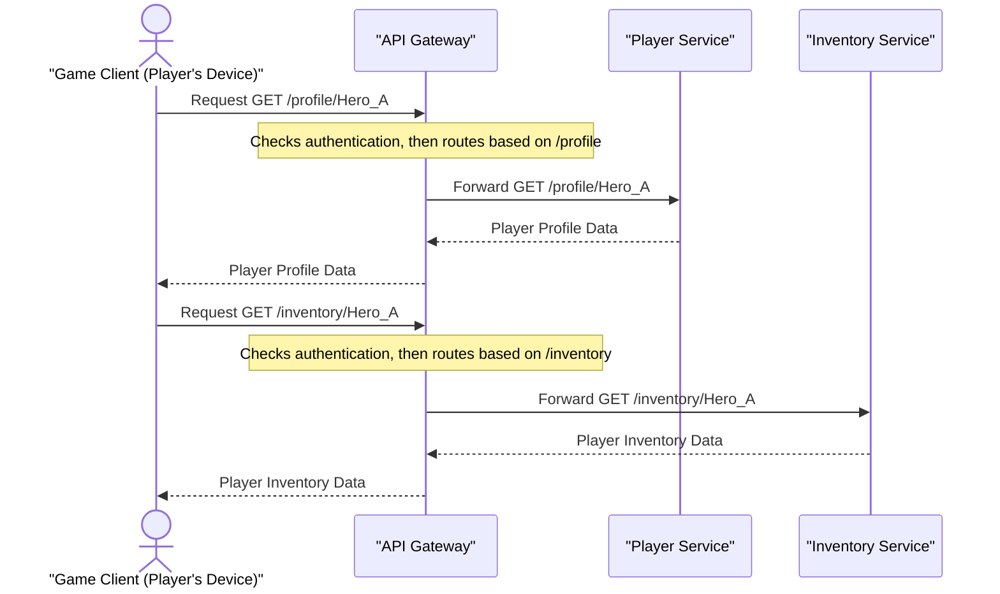

# Chapter 4: API Gateway

In our last chapter, we delved into [Microservices Architecture](03_microservices_architecture_.md), learning how to break down a large application like our "Cloud Adventure" game into many small, independent services – like a city with specialized shops. We have a `Player Service`, an `Inventory Service`, a `Shop Service`, a `Quest Service`, and so on.

This approach offers amazing benefits: independent scaling, faster development, and better resilience. But imagine you, the game client (the player's computer or phone), need to interact with all these different services.

*   To check your player profile, you'd call the `Player Service`.
*   To see your items, you'd call the `Inventory Service`.
*   To browse daily deals, you'd call the `Shop Service`.
*   To get your quest log, you'd call the `Quest Service`.

Suddenly, your game client needs to know the addresses of many different services, and each might have different ways to authenticate you or might be hosted on different servers. This can quickly become messy, complicated, and a security risk for the client. What if the address of the `Player Service` changes? You'd have to update every game client!

This is where the **API Gateway** comes to the rescue!

## What is an API Gateway?

An **API Gateway** acts as a single, smart entry point for all client requests into your application, especially when you have a [Microservices Architecture](03_microservices_architecture_.md). Think of it like a **doorman or a receptionist at a large, bustling office building.**

Here's how the analogy works:

*   **You (the Client):** A visitor wanting to reach different departments (microservices).
*   **The Office Building (Your Microservices Application):** Contains many specialized departments (Player Service, Inventory Service, Shop Service).
*   **The Doorman/Receptionist (The API Gateway):**
    *   Greets all visitors at a single main entrance.
    *   Asks who you are (authentication).
    *   Checks if you're allowed in (authorization).
    *   Directs you to the correct department (routing).
    *   Might limit how many visitors enter at once to prevent overcrowding (rate limiting).
    *   Can even gather information from a few departments for you and give you a combined answer (response aggregation).

You, as the visitor, only need to know how to talk to the doorman. You don't need to know the exact floor or office number for every department. The doorman handles all that complexity for you.

## Key Jobs of an API Gateway

An API Gateway has several important responsibilities:

1.  **Single Entry Point:** All client requests come through one unified address. This simplifies how clients interact with your system.
2.  **Request Routing:** It acts like a traffic controller, directing incoming requests to the appropriate internal microservice. For example, a request for `/profile` goes to the `Player Service`, while `/inventory` goes to the `Inventory Service`.
3.  **Authentication and Authorization:** It can verify who you are (authentication) and what you're allowed to do (authorization) *before* sending your request to any microservice. This centralizes security.
4.  **Rate Limiting:** To prevent abuse or overwhelming your backend services, the API Gateway can limit the number of requests a client can make in a certain period.
5.  **Response Aggregation (Optional):** Sometimes, a single client request needs data from multiple microservices. The API Gateway can call several services, gather their responses, and combine them into a single, unified response for the client.

## Solving the "Cloud Adventure" Client Interaction with an API Gateway

Let's see how our "Cloud Adventure" game client would interact with our microservices if we used an API Gateway.

Instead of the game client calling `player-service.cloudadventure.com` *and* `inventory-service.cloudadventure.com`, it will only call `api.cloudadventure.com`.

```python
# --- game_client.py (Simplified) ---
# Without API Gateway:
# player_data = make_request("GET", "https://player-service.cloudadventure.com/profile/Hero_A")
# inventory_data = make_request("GET", "https://inventory-service.cloudadventure.com/items/Hero_A")

# WITH API Gateway:
# The client only knows about ONE address for the entire game backend.
api_gateway_url = "https://api.cloudadventure.com"

def get_player_profile(player_id):
    """Client requests player profile via API Gateway."""
    print(f"Game Client: Requesting profile for {player_id} from {api_gateway_url}/profile/{player_id}")
    # In a real app, this would be an HTTP request
    return {"name": "Hero_A", "level": 15, "class": "Warrior"} # Dummy response

def get_player_inventory(player_id):
    """Client requests player inventory via API Gateway."""
    print(f"Game Client: Requesting inventory for {player_id} from {api_gateway_url}/inventory/{player_id}")
    # In a real app, this would be an HTTP request
    return [{"item_id": "sword_01", "name": "Iron Sword"}, {"item_id": "potion_03", "name": "Health Potion"}] # Dummy response

# --- Main game logic ---
current_player_id = "Hero_A"

profile = get_player_profile(current_player_id)
print(f"Received Profile: {profile}")

inventory = get_player_inventory(current_player_id)
print(f"Received Inventory: {inventory}")

# Expected Output:
# Game Client: Requesting profile for Hero_A from https://api.cloudadventure.com/profile/Hero_A
# Received Profile: {'name': 'Hero_A', 'level': 15, 'class': 'Warrior'}
# Game Client: Requesting inventory for Hero_A from https://api.cloudadventure.com/inventory/Hero_A
# Received Inventory: [{'item_id': 'sword_01', 'name': 'Iron Sword'}, {'item_id': 'potion_03', 'name': 'Health Potion'}]
```
In this simplified `game_client.py` example, you can see that the game client only ever needs to know the `api_gateway_url`. It sends all requests to this single address, and the API Gateway handles figuring out which microservice should actually receive the request. This greatly simplifies the client's code and its management.

## Under the Hood: How the API Gateway Works

Let's visualize the "Add to Cart" process using a simple diagram:


This diagram shows how the `Game Client` sends all its requests to the `API Gateway`. The `API Gateway` then intelligently forwards these requests to the correct internal microservice (`Player Service` or `Inventory Service` in this example), and once the microservice responds, the Gateway passes that response back to the `Game Client`.

### A Peek at API Gateway Logic (Conceptual)

Let's imagine a very, very simplified version of what the API Gateway might be doing internally.

```python
# --- api_gateway.py (Conceptual - simplified for routing) ---

# Internal addresses of our microservices
PLAYER_SERVICE_URL = "http://internal-player-service:8080"
INVENTORY_SERVICE_URL = "http://internal-inventory-service:8081"
# ... other service URLs ...

def handle_incoming_request(method, path, headers=None, body=None):
    """
    Simulates the API Gateway receiving a request and routing it.
    In a real system, this involves HTTP proxies, load balancers, etc.
    """
    print(f"\nAPI Gateway: Received {method} request for path: {path}")

    # 1. Perform Authentication/Authorization (conceptual)
    if not is_authenticated(headers):
        print("API Gateway: Authentication failed!")
        return {"status": 401, "body": "Unauthorized"}
    print("API Gateway: User is authenticated.")

    # 2. Route the request based on the path
    if path.startswith("/profile"):
        # Forward to Player Service
        target_url = PLAYER_SERVICE_URL + path
        print(f"API Gateway: Routing to Player Service at {target_url}")
        # In a real system, would make an actual HTTP request to PlayerService
        return {"status": 200, "body": {"name": "Hero_A", "level": 15}} # Dummy response
    elif path.startswith("/inventory"):
        # Forward to Inventory Service
        target_url = INVENTORY_SERVICE_URL + path
        print(f"API Gateway: Routing to Inventory Service at {target_url}")
        # In a real system, would make an actual HTTP request to InventoryService
        return {"status": 200, "body": [{"item": "Iron Sword"}]} # Dummy response
    else:
        print("API Gateway: No route found for this path.")
        return {"status": 404, "body": "Not Found"}

def is_authenticated(headers):
    """Dummy function for authentication check."""
    # In reality, this would check JWT tokens, API keys, etc.
    return True # Always authenticated for this example

# --- Simulating client requests arriving at the Gateway ---
# A client wants their profile
response_profile = handle_incoming_request("GET", "/profile/Hero_A", {"Authorization": "Bearer token123"})
print(f"Gateway Response for profile: {response_profile['status']} - {response_profile['body']}")

# A client wants their inventory
response_inventory = handle_incoming_request("GET", "/inventory/Hero_A", {"Authorization": "Bearer token123"})
print(f"Gateway Response for inventory: {response_inventory['status']} - {response_inventory['body']}")

# Expected Output:
# API Gateway: Received GET request for path: /profile/Hero_A
# API Gateway: User is authenticated.
# API Gateway: Routing to Player Service at http://internal-player-service:8080/profile/Hero_A
# Gateway Response for profile: 200 - {'name': 'Hero_A', 'level': 15}

# API Gateway: Received GET request for path: /inventory/Hero_A
# API Gateway: User is authenticated.
# API Gateway: Routing to Inventory Service at http://internal-inventory-service:8081/inventory/Hero_A
# Gateway Response for inventory: 200 - [{'item': 'Iron Sword'}]
```
This conceptual `api_gateway.py` code shows the basic idea. The `handle_incoming_request` function first checks if the user is authenticated (using our simplified `is_authenticated` function). Then, it looks at the `path` of the request (`/profile`, `/inventory`) and decides which internal microservice to send it to. It then conceptually forwards the request and returns the microservice's dummy response.

## Why Use an API Gateway?

| Feature                   | Without API Gateway (Client directly calls Microservices)         | With API Gateway                                         |
| :------------------------ | :---------------------------------------------------------------- | :--------------------------------------------------------- |
| **Client Simplicity**     | Client needs to know many service addresses and their specifics.  | Client only knows one API Gateway address.                |
| **Security**              | Clients might directly access internal services, higher risk.     | Centralized authentication/authorization at the Gateway.   |
| **Service Evolution**     | Changing internal service addresses means updating all clients.   | Internal service changes are hidden from clients.         |
| **Cross-Cutting Concerns**| Each microservice needs to implement authentication, rate limiting, logging. | Handled once at the Gateway, reducing microservice burden. |
| **Request Aggregation**   | Client must make multiple calls and combine data itself.          | Gateway can combine responses from multiple services.     |
| **Management**            | Harder to monitor all client-service interactions.                | Easier to monitor and control traffic flow.               |

## Conclusion

The API Gateway is a vital component in modern distributed systems, especially those built with [Microservices Architecture](03_microservices_architecture_.md). It simplifies client-side interactions by providing a single entry point, centralizes crucial tasks like security and rate limiting, and decouples clients from the internal complexities and changes of your backend services. It's the essential "doorman" that ensures smooth, secure, and organized access to your growing application.

Next, as our systems become more distributed and rely on many independent services, what happens if one of those services fails or becomes slow? How do we prevent a single problem from bringing down the entire system? We'll explore this critical concept in [Circuit Breaker Pattern](05_circuit_breaker_pattern_.md)!
