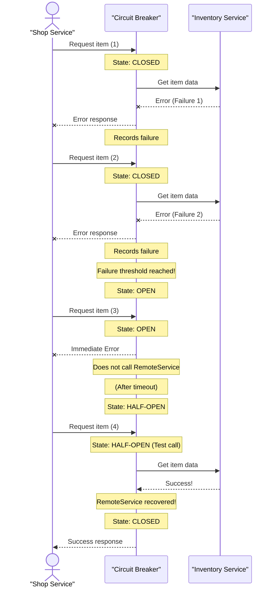

# Chapter 5: Circuit Breaker Pattern

In our journey through [Microservices Architecture](03_microservices_architecture_.md) and [API Gateway](04_api_gateway_.md), we learned how to build robust systems by breaking them into small, independent services. The API Gateway acts as a smart doorman, directing requests to the right service. But what happens if one of those independent services suddenly runs into trouble?

Imagine our "Cloud Adventure" game is humming along. The `Shop Service` (which lets players buy items) needs to check with the `Inventory Service` (to add items to a player's bag) and the `Player Service` (to deduct gold). What if, due to a bug or heavy load, the `Inventory Service` becomes very slow or completely unresponsive?

If the `Shop Service` keeps trying to call the `Inventory Service` repeatedly, it will experience long delays, exhaust its own resources (like memory or connections), and eventually slow down or fail itself. This single problem in the `Inventory Service` could then cause the `Shop Service` to fail, which might then affect other services that rely on the `Shop Service`. This is what we call a **cascading failure** – one failure triggering many more, potentially bringing down large parts of our game!

How can we prevent one troubled service from dragging down the entire system? The answer is the **Circuit Breaker Pattern**.

## What is the Circuit Breaker Pattern?

The Circuit Breaker pattern is a design pattern used to prevent cascading failures in distributed systems. It's like an electrical circuit breaker in your home:

*   If an appliance (like a toaster) malfunctions or draws too much power (a failing service), the circuit breaker "trips."
*   This immediately cuts off power to that circuit (stops calls to the failing service) to prevent damage to the entire house (your application).
*   After a while, you can flip the breaker back on (allow a test call) to see if the problem is resolved.

In software, a circuit breaker acts as a proxy for operations that might fail, such as calling a remote service or accessing a database. It wraps these operations and monitors their failures.

## The Three States of a Circuit Breaker

A circuit breaker typically operates in three main states:

1.  **Closed:** This is the normal state. Calls to the protected service pass through the circuit breaker directly. The circuit breaker monitors for failures. If the number of failures crosses a certain threshold within a given time, the circuit "trips" and moves to the **Open** state.
2.  **Open:** In this state, the circuit breaker immediately blocks all calls to the protected service. Instead of even trying to call the service (which we know is failing), it returns an error instantly. This gives the failing service time to recover and prevents the calling service from wasting resources or getting stuck. After a configured timeout period, it moves to the **Half-Open** state.
3.  **Half-Open:** After the timeout in the Open state, the circuit breaker allows a limited number of test calls to pass through to the protected service.
    *   If these test calls succeed, it means the service might have recovered, and the circuit moves back to the **Closed** state.
    *   If these test calls fail again, the service is still having problems, and the circuit immediately moves back to the **Open** state for another timeout period.

## Solving the "Cloud Adventure" Cascading Failure Use Case

Let's apply this to our "Cloud Adventure" `Shop Service` needing to talk to the `Inventory Service`. We'll put a circuit breaker around the call to the `Inventory Service`.

Here's how it would work conceptually:

```python
# --- inventory_service_simulator.py (Our potentially failing service) ---
import random

def get_item_data(item_id):
    """
    Simulates fetching item data from Inventory Service.
    It will 'fail' sometimes to demonstrate the circuit breaker.
    """
    if random.random() < 0.7: # 70% chance of failure (high for demo)
        print(f"Inventory Service: ERROR - Failed to get data for {item_id}!")
        raise ConnectionError("Inventory Service is down or slow!")
    print(f"Inventory Service: Successfully retrieved data for {item_id}.")
    return {"id": item_id, "name": f"Item {item_id}", "details": "Awesome!"}

# This is the external service we want to protect against.
```
This `get_item_data` function simulates our `Inventory Service`. Most of the time, it will fail (raise an error). This is what our circuit breaker needs to handle!

Now, let's see how a `Shop Service` might use a conceptual circuit breaker to call this `Inventory Service`:

```python
# --- shop_service_with_circuit_breaker.py (Conceptual) ---
import time
from inventory_service_simulator import get_item_data

# A very basic Circuit Breaker simulation
class SimpleCircuitBreaker:
    def __init__(self, failure_threshold=3, reset_timeout_seconds=5):
        self.state = "CLOSED"
        self.failure_count = 0
        self.last_failure_time = 0
        self.failure_threshold = failure_threshold
        self.reset_timeout_seconds = reset_timeout_seconds
        print(f"Circuit Breaker initialized: {self.state}")

    def call(self, service_function, *args, **kwargs):
        current_time = time.time()

        if self.state == "OPEN":
            if current_time - self.last_failure_time > self.reset_timeout_seconds:
                self.state = "HALF-OPEN"
                print(f"Circuit Breaker: Changed to HALF-OPEN state (trying a test call).")
            else:
                print(f"Circuit Breaker: OPEN (Service is down). Returning fallback error immediately.")
                return None # Immediately return a fallback/error

        try:
            result = service_function(*args, **kwargs)
            self.record_success()
            return result
        except Exception as e:
            self.record_failure()
            print(f"Circuit Breaker: Call failed. Current state: {self.state}. Error: {e}")
            return None # Return a fallback/error

    def record_failure(self):
        self.failure_count += 1
        self.last_failure_time = time.time()
        if self.state == "CLOSED" and self.failure_count >= self.failure_threshold:
            self.state = "OPEN"
            print(f"Circuit Breaker: Tripped to OPEN state! Too many failures.")
        elif self.state == "HALF-OPEN":
            self.state = "OPEN"
            print(f"Circuit Breaker: Test call failed in HALF-OPEN state. Back to OPEN.")

    def record_success(self):
        if self.state != "CLOSED":
            self.state = "CLOSED"
            self.failure_count = 0
            print(f"Circuit Breaker: Service recovered! Back to CLOSED state.")

# --- Shop Service simulation using the Circuit Breaker ---
item_breaker = SimpleCircuitBreaker(failure_threshold=2, reset_timeout_seconds=3)

print("\n--- Simulating Shop Service trying to get item data ---")
for i in range(10):
    print(f"\nAttempt {i+1}:")
    item = item_breaker.call(get_item_data, "P101")
    if item:
        print(f"Shop Service: Successfully received item: {item['name']}")
    else:
        print("Shop Service: Could not get item data (Circuit Breaker active or service down).")
    time.sleep(0.5) # Simulate some delay between calls

print("\n--- Waiting for timeout to try Half-Open state ---")
time.sleep(4) # Wait longer than reset_timeout_seconds

print("\n--- Attempt after timeout (Half-Open test) ---")
item = item_breaker.call(get_item_data, "P101")
if item:
    print(f"Shop Service: Successfully received item: {item['name']}")
else:
    print("Shop Service: Could not get item data (Circuit Breaker active or service down).")

# Expected Output (will vary slightly due to random.random(), but pattern is consistent):
# Circuit Breaker initialized: CLOSED
#
# --- Simulating Shop Service trying to get item data ---
#
# Attempt 1:
# Inventory Service: ERROR - Failed to get data for P101!
# Circuit Breaker: Call failed. Current state: CLOSED. Error: Inventory Service is down or slow!
# Shop Service: Could not get item data (Circuit Breaker active or service down).
#
# Attempt 2:
# Inventory Service: ERROR - Failed to get data for P101!
# Circuit Breaker: Tripped to OPEN state! Too many failures.
# Circuit Breaker: Call failed. Current state: OPEN. Error: Inventory Service is down or slow!
# Shop Service: Could not get item data (Circuit Breaker active or service down).
#
# Attempt 3:
# Circuit Breaker: OPEN (Service is down). Returning fallback error immediately.
# Shop Service: Could not get item data (Circuit Breaker active or service down).
#
# Attempt 4:
# Circuit Breaker: OPEN (Service is down). Returning fallback error immediately.
# Shop Service: Could not get item data (Circuit Breaker active or service down).
# ... (continues for Attempts 5-8) ...
#
# --- Waiting for timeout to try Half-Open state ---
#
# --- Attempt after timeout (Half-Open test) ---
# Circuit Breaker: Changed to HALF-OPEN state (trying a test call).
# Inventory Service: Successfully retrieved data for P101. (Or might fail again)
# Circuit Breaker: Service recovered! Back to CLOSED state. (If successful)
# Shop Service: Successfully received item: Item P101
```
In this example, our `SimpleCircuitBreaker` wraps the call to `get_item_data`.
1.  Initially, it's `CLOSED`. When `get_item_data` fails a few times, the breaker `TRIPS` to `OPEN`.
2.  While `OPEN`, subsequent calls don't even try to hit the `Inventory Service`; they fail immediately, saving resources.
3.  After a timeout, it goes `HALF-OPEN` to allow one test call. If that call succeeds, it resets to `CLOSED`. If it fails, it goes back to `OPEN`.

## Under the Hood: The Circuit Breaker Flow

Let's visualize how a request flows through a circuit breaker and its state changes.


This diagram illustrates the key state transitions. When the `CallingService` makes a request, the `CircuitBreaker` intercepts it. It starts `CLOSED`, moving to `OPEN` if too many failures occur. In the `OPEN` state, it quickly returns an error without even trying the `RemoteService`. After a timeout, it transitions to `HALF-OPEN` to test the `RemoteService` with a single call. If that call succeeds, it fully `CLOSES` again.

## Why Use the Circuit Breaker Pattern?

| Feature                      | Without Circuit Breaker (Direct Service Calls)           | With Circuit Breaker Pattern                             |
| :--------------------------- | :------------------------------------------------------- | :------------------------------------------------------- |
| **Cascading Failures**       | High risk; one failing service can bring down others.    | Greatly reduced risk; isolates failures.                 |
| **Resource Exhaustion**      | Calling service can exhaust network connections, threads, memory by waiting for failing service. | Prevents resource exhaustion by failing fast.            |
| **Recovery Time**            | Failing service under continuous load might take longer to recover. | Allows failing service to recover without being hammered by constant requests. |
| **User Experience (Calling Service)** | Long delays, timeouts, or complete freezes.              | Faster failures (immediate error), possibly allowing for fallback options or retries. |
| **Complexity**               | Simpler initial implementation.                          | Adds a layer of complexity to manage states and timeouts. |

## Conclusion

The Circuit Breaker pattern is a powerful technique for building resilient distributed systems. By wrapping potentially failing service calls and implementing the three states (Closed, Open, Half-Open), it effectively prevents cascading failures, protects resources, and allows troubled services the breathing room they need to recover. It ensures that a localized problem doesn't turn into a system-wide outage, making your application more robust and available.

As we continue to build and manage complex distributed systems, ensuring that our data remains correct and consistent across many services becomes a crucial challenge. In our next chapter, we'll dive into [Consistency (in Distributed Systems)](06_consistency__in_distributed_systems__.md) to understand how to tackle this.
