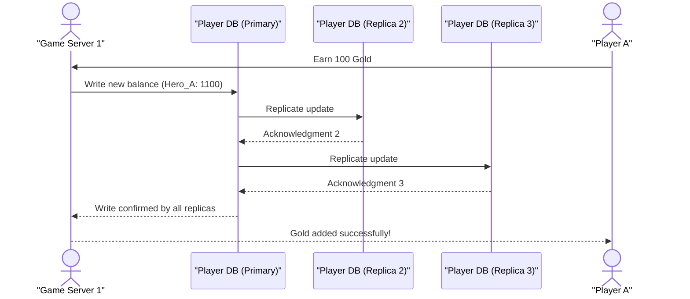
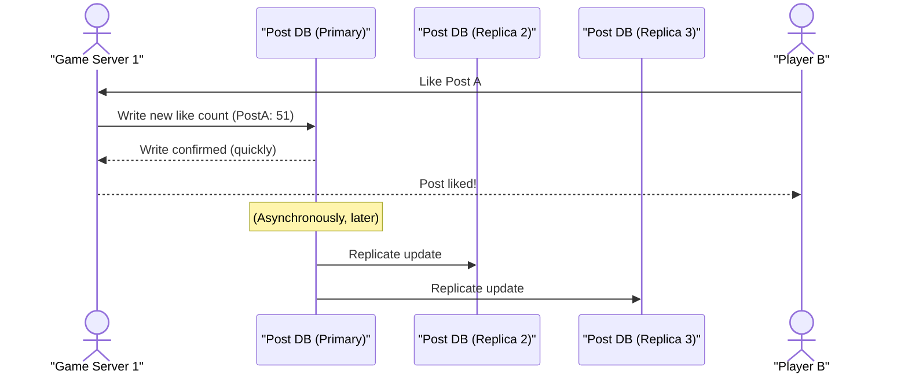

# Chapter 6: Consistency (in Distributed Systems)

In our previous chapter, [Circuit Breaker Pattern](05_circuit_breaker_pattern_.md), we learned how to protect our individual services from failing when another service they rely on runs into trouble. This helps make our systems more robust and available. But what about the *data* in our distributed system?

Imagine our "Cloud Adventure" game, which has grown so popular that it runs on many different servers (thanks to [Horizontal Scaling](01_scalability_.md) and [Microservices Architecture](03_microservices_architecture_.md)!). What if a player, "Hero_A", earns 100 gold by completing a quest on `Game Server 1`? And immediately afterwards, they try to spend that gold in the in-game shop, which happens to be handled by `Game Server 2`?

*   Will `Game Server 2` immediately know that "Hero_A" now has 100 more gold?
*   What if the balance on `Game Server 1` says 1000 gold, but the balance on `Game Server 2` still says 900 gold because it hasn't received the update yet?
*   Could "Hero_A" accidentally spend gold they don't actually have (because `Game Server 2` thinks they have less)? Or worse, could they spend the *same* gold twice by interacting with different servers before they're fully updated?

This is the core challenge of **Consistency** in distributed systems: **how do we ensure that all copies of our data, spread across different computers, show the same, correct, and up-to-date information at any given time?**

## What is Consistency?

In distributed systems, **consistency** refers to the guarantee that every read operation returns the most recent write operation or an error. Simply put, when you ask for a piece of data, you expect to get the *latest* version of that data.

Achieving this perfectly when data is copied across many machines is very difficult and often involves tradeoffs. Let's look at the two main types of consistency guarantees:

### 1. Strong Consistency (Immediate Agreement)

Imagine you and your friends are sharing a physical whiteboard. When someone writes something on it, everyone in the room sees the exact same thing *immediately*. There's no delay; everyone has the exact same, most up-to-date information.

In a distributed system, **strong consistency** means that once a piece of data is written or updated, all subsequent read operations will see that updated data, no matter which server they query. It's like a bank account: if you deposit money at one ATM, you expect that money to be immediately reflected in your balance at *any other* ATM or online banking portal.

**Pros:**
*   Always get the latest data.
*   Easier for developers to reason about (data behaves predictably).

**Cons:**
*   **Slower:** To guarantee everyone sees the same thing immediately, all copies of the data must be updated and confirm the update before the write operation is considered complete. This takes time and coordination.
*   **Less Available:** If one server holding a copy of the data is down or slow, the entire write operation might fail or be significantly delayed, making the system less available.

### 2. Eventual Consistency (Eventually Agreement)

Now, imagine you and your friends are in different rooms, each with your own small whiteboard. When someone writes on *their* whiteboard, that change is eventually copied to everyone else's whiteboard, but it might take a moment. For a short period, your whiteboard might show slightly different information than your friend's, but eventually, all whiteboards will match.

In a distributed system, **eventual consistency** means that after a piece of data is written, it might take some time for all copies of that data to be updated. During this brief period, different servers might return different values for the same piece of data. However, the system guarantees that eventually, all copies will converge and become the same, assuming no new writes happen. Think of social media "likes": if you like a post, it might appear instantly on your screen, but it could take a second or two for that like count to update for all your friends, especially if they are viewing it from a different server.

**Pros:**
*   **Faster Writes:** The system can quickly confirm a write operation without waiting for all copies to update.
*   **More Available:** If one server is down, other servers can still process reads and writes, and the updates will propagate when the downed server recovers.

**Cons:**
*   **Temporary Divergence:** For a short time, you might read stale data.
*   **Harder to Reason About:** Developers need to be aware that a read might not return the absolute latest data, which can complicate application logic.

## The CAP Theorem (A Quick Mention)

The challenges of consistency often bring up the **CAP Theorem**. It's a fundamental principle for distributed systems that states you can only choose **two** out of three guarantees:

*   **Consistency (C):** Every read receives the most recent write or an error.
*   **Availability (A):** Every request receives a (non-error) response, without guarantee that it is the most recent write.
*   **Partition Tolerance (P):** The system continues to operate despite arbitrary numbers of messages being dropped (or delayed) by the network between nodes. (Network partitions are common in distributed systems).

In essence, in a distributed system, when a network problem (a "partition") occurs, you have to make a choice:
*   **CP (Consistency and Partition Tolerance):** If you want strong consistency, you might have to sacrifice availability during a network partition. (e.g., if a server can't reach the "latest" data, it returns an error).
*   **AP (Availability and Partition Tolerance):** If you want high availability, you might have to sacrifice strong consistency during a network partition. (e.g., a server returns whatever data it has, even if it's slightly old).

Most large-scale distributed systems opt for **AP** (Availability and Partition Tolerance) and accept **eventual consistency** because high availability is often more critical for user experience.

## Solving the "Cloud Adventure" Player Gold Use Case

Let's look at how adding gold to a player's account in "Cloud Adventure" might work under different consistency models. We'll simulate `Game Server 1` updating a player's gold, and other "servers" (or data replicas) needing to reflect that change.

### Scenario: Strong Consistency for Gold Balance

For something critical like player gold, you generally want strong consistency. You don't want a player's balance to be different on two different servers.

```python
# Conceptual representation of a distributed ledger for player gold
# In a real system, these would be separate database instances or nodes.
player_gold_db_server1 = {"Hero_A": 1000}
player_gold_db_server2 = {"Hero_A": 1000}
player_gold_db_server3 = {"Hero_A": 1000}

def update_gold_strongly_consistent(player_id, amount):
    """
    Simulates updating player gold with strong consistency.
    Requires all 'servers' to acknowledge the update.
    """
    print(f"\n--- Strong Consistency Update for {player_id} ---")
    new_balance = player_gold_db_server1[player_id] + amount

    # 1. Update on primary server (conceptually)
    player_gold_db_server1[player_id] = new_balance
    print(f"Server 1 (Primary): Updated {player_id} to {new_balance} gold.")

    # 2. Replicate to all other servers and wait for acknowledgment
    #    This is simplified. In reality, it involves complex protocols.
    player_gold_db_server2[player_id] = new_balance
    player_gold_db_server3[player_id] = new_balance
    print(f"Server 2: Acknowledged update for {player_id}.")
    print(f"Server 3: Acknowledged update for {player_id}.")

    print(f"SUCCESS: All servers consistent for {player_id}'s gold.")
    return True

def get_gold(player_id, server_name, db_instance):
    """Reads gold from a specific server's database."""
    return f"Server {server_name}: {player_id} has {db_instance[player_id]} gold."

# Initial state
print(get_gold("Hero_A", "1", player_gold_db_server1))
print(get_gold("Hero_A", "2", player_gold_db_server2))
print(get_gold("Hero_A", "3", player_gold_db_server3))

# Hero_A earns 100 gold (Strongly Consistent)
update_gold_strongly_consistent("Hero_A", 100)

# Check balances immediately after update
print(get_gold("Hero_A", "1", player_gold_db_server1))
print(get_gold("Hero_A", "2", player_gold_db_server2))
print(get_gold("Hero_A", "3", player_gold_db_server3))

# Expected Output:
# Server 1: Hero_A has 1000 gold.
# Server 2: Hero_A has 1000 gold.
# Server 3: Hero_A has 1000 gold.
#
# --- Strong Consistency Update for Hero_A ---
# Server 1 (Primary): Updated Hero_A to 1100 gold.
# Server 2: Acknowledged update for Hero_A.
# Server 3: Acknowledged update for Hero_A.
# SUCCESS: All servers consistent for Hero_A's gold.
# Server 1: Hero_A has 1100 gold.
# Server 2: Hero_A has 1100 gold.
# Server 3: Hero_A has 1100 gold.
```
In this simplified example, the `update_gold_strongly_consistent` function not only updates the primary `player_gold_db_server1` but also ensures that the changes are propagated to `player_gold_db_server2` and `player_gold_db_server3` *before* it considers the operation a success. This guarantees that any subsequent read from *any* server will see the updated gold balance.

### Scenario: Eventual Consistency for "Likes" on a Post

For less critical data, like the number of "likes" on a game's social post, eventual consistency might be acceptable. It's okay if a "like" count takes a second to update globally.

```python
import time
import threading

# Conceptual representation of a distributed counter for post likes
post_likes_db_server1 = {"post_A": 50}
post_likes_db_server2 = {"post_A": 50}
post_likes_db_server3 = {"post_A": 50}

def propagate_update_async(player_id, new_likes, target_db, delay_seconds):
    """Simulates asynchronous propagation of an update."""
    time.sleep(delay_seconds) # Simulate network delay
    target_db[player_id] = new_likes
    print(f"  (Async) Updated target server after {delay_seconds}s: {target_db[player_id]} likes.")

def add_like_eventually_consistent(post_id):
    """
    Simulates adding a like with eventual consistency.
    Quickly confirms, then propagates asynchronously.
    """
    print(f"\n--- Eventual Consistency Update for {post_id} ---")
    # 1. Update on primary server (conceptually)
    post_likes_db_server1[post_id] += 1
    current_likes = post_likes_db_server1[post_id]
    print(f"Server 1 (Primary): Updated {post_id} to {current_likes} likes. Confirmed immediately.")

    # 2. Asynchronously propagate to other servers
    #    (Doesn't wait for these to complete before returning)
    threading.Thread(target=propagate_update_async, args=(post_id, current_likes, post_likes_db_server2, 2)).start()
    threading.Thread(target=propagate_update_async, args=(post_id, current_likes, post_likes_db_server3, 3)).start()

    return True

def get_likes(post_id, server_name, db_instance):
    """Reads likes from a specific server's database."""
    return f"Server {server_name}: {post_id} has {db_instance[post_id]} likes."

# Initial state
print(get_likes("post_A", "1", post_likes_db_server1))
print(get_likes("post_A", "2", post_likes_db_server2))
print(get_likes("post_A", "3", post_likes_db_server3))

# Player likes post_A (Eventually Consistent)
add_like_eventually_consistent("post_A")

# Check balances immediately after update (will likely show temporary divergence)
print(get_likes("post_A", "1", post_likes_db_server1))
print(get_likes("post_A", "2", post_likes_db_server2)) # Might be old
print(get_likes("post_A", "3", post_likes_db_server3)) # Might be old

print("\n(Waiting for asynchronous updates to complete...)")
time.sleep(4) # Wait for propagation to finish

# Check balances after propagation
print(get_likes("post_A", "1", post_likes_db_server1))
print(get_likes("post_A", "2", post_likes_db_server2))
print(get_likes("post_A", "3", post_likes_db_server3))

# Expected Output (timing will vary slightly due to threads):
# Server 1: post_A has 50 likes.
# Server 2: post_A has 50 likes.
# Server 3: post_A has 50 likes.
#
# --- Eventual Consistency Update for post_A ---
# Server 1 (Primary): Updated post_A to 51 likes. Confirmed immediately.
# Server 1: post_A has 51 likes.
# Server 2: post_A has 50 likes. # Divergence!
# Server 3: post_A has 50 likes. # Divergence!
#
# (Waiting for asynchronous updates to complete...)
#   (Async) Updated target server after 2s: 51 likes.
#   (Async) Updated target server after 3s: 51 likes.
# Server 1: post_A has 51 likes.
# Server 2: post_A has 51 likes.
# Server 3: post_A has 51 likes.
```
Here, `add_like_eventually_consistent` quickly updates `post_likes_db_server1` and immediately returns. The updates to `post_likes_db_server2` and `post_likes_db_server3` happen in the background (simulated with `threading.Thread` and `time.sleep`). This means that for a few seconds, if a user queries `Server 2` or `Server 3`, they might see the old "like" count, but eventually, all servers will show the same, correct value.

## Under the Hood: Data Replication and Consistency

How do these different consistency models affect how data moves between servers?

### Strong Consistency Flow (e.g., for Player Gold)

When strong consistency is required, a write operation typically involves multiple steps and acknowledgments to ensure all copies are up-to-date before the operation is confirmed.


In this flow, `Game Server 1` sends the request to the `Player DB (Primary)`. The primary database then *synchronously* replicates the update to `Replica 2` and `Replica 3` and waits for their acknowledgments. Only once all replicas confirm the write, does the `Player DB (Primary)` confirm back to `Game Server 1`, which then tells `Player A` that the gold was added. This guarantees `Player A` (and any other player checking their balance) will see the new balance instantly.

### Eventual Consistency Flow (e.g., for Post Likes)

With eventual consistency, the write operation is confirmed much faster, and replication happens in the background.


Here, `Game Server 1` sends the "like" request to the `Post DB (Primary)`. The primary database updates its own copy and immediately confirms the write back to `Game Server 1`, which then tells `Player B` that the post was liked. The replication to `Replica 2` and `Replica 3` happens *later* and asynchronously. During that delay, if someone were to read the like count from `Post DB (Replica 2)`, they might see the old count of 50, not the new 51, until the replication finishes.

## Strong vs. Eventual Consistency: A Comparison

Choosing between strong and eventual consistency depends heavily on your application's requirements.

| Feature                    | Strong Consistency                                     | Eventual Consistency                                        |
| :------------------------- | :----------------------------------------------------- | :---------------------------------------------------------- |
| **Guarantee**              | All reads see the most recent write.                   | Eventually, all reads will see the most recent write.       |
| **Data Staleness**         | No stale data; always real-time.                       | Data can be temporarily stale.                              |
| **Performance (Writes)**   | Slower, as writes must wait for replication.            | Faster, as writes are confirmed quickly.                    |
| **Performance (Reads)**    | Can be slower if read requires global coordination.     | Faster, as reads often hit local copies.                    |
| **Availability**           | Lower during network partitions or server failures.    | Higher during network partitions or server failures.        |
| **Complexity for Devs**    | Simpler logic (data is always what you expect).        | More complex logic (need to handle potential stale reads).  |
| **Typical Use Cases**      | Banking transactions, inventory management, user logins, critical game currency. | Social media feeds, comment counts, product recommendations, online presence indicators. |

## Conclusion

Consistency is a critical concept in distributed systems, especially when data is replicated across multiple servers to improve [Scalability](01_scalability_.md) and [Availability](README.md#key-concepts-short-notes). You learned about **strong consistency**, which guarantees immediate data agreement across all copies, and **eventual consistency**, which allows temporary divergence but ensures data will eventually converge. Understanding the tradeoffs between these models, often framed by the CAP Theorem, is crucial for designing robust systems that meet specific application needs.

In our next chapter, we'll explore [Event-Driven Architecture](07_event_driven_architecture_.md), a design pattern that often pairs well with eventual consistency, allowing different parts of your system to react to changes and propagate data updates in a loosely coupled and scalable way.
