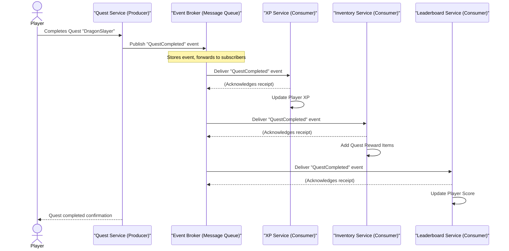

# Chapter 7: Event-Driven Architecture

In our previous chapter, [Consistency (in Distributed Systems)](06_consistency__in_distributed_systems__.md), we explored how difficult it can be to keep data perfectly synchronized across many different servers in a large system. We learned about strong consistency (everything agrees immediately) and eventual consistency (everything agrees eventually). Now, let's think about how different parts of our application, especially in a [Microservices Architecture](03_microservices_architecture_.md), talk to each other to make those updates happen.

Imagine our "Cloud Adventure" game is thriving! Players are completing quests, buying items, leveling up, and making new friends. For each of these actions, many different systems might need to react. When a player completes a quest, for example:
*   Their experience points (XP) need to be updated.
*   New items might need to be added to their inventory.
*   Their progress on a leaderboard might change.
*   They might even unlock an achievement!

If the `Quest Service` (the part of our game that tracks quests) had to directly call the `XP Service`, then the `Inventory Service`, then the `Leaderboard Service`, and finally the `Achievement Service`, it would be a very long, tightly coupled chain of commands. What if the `Leaderboard Service` is temporarily down? The `Quest Service` would get stuck, unable to finish its work, and the player wouldn't get their items or achievements. Also, what if we later decide to add a new "Player Statistics Service" that also needs to know when quests are completed? We'd have to go back and modify the `Quest Service` to add another direct call. This approach becomes rigid and fragile very quickly.

This is where **Event-Driven Architecture** comes to the rescue! It offers a much more flexible and scalable way for different parts of your system to communicate.

## What is Event-Driven Architecture?

**Event-Driven Architecture (EDA)** is an architectural pattern where components in your system communicate by producing (sending) and consuming (receiving) **events**, rather than making direct, explicit calls to each other.

Think back to our analogy of a busy office from the introduction:
Instead of directly telling colleagues what to do ("Hey, Bob, go add 100 XP to Player X, then tell Sarah to give them a sword, then tell Mark to update the leaderboard..."), everyone just announces **"I've finished task X"** (an event).

Any other colleagues who "care about task X being finished" then automatically pick up their work based on that announcement. Bob hears "Quest Completed," and adds XP. Sarah hears "Quest Completed," and gives a sword. Mark hears it and updates the leaderboard. The person who finished the quest doesn't need to know who Bob, Sarah, or Mark are, or what they will do next. They just announce a fact: "The quest is done!"

This creates **loose coupling**, meaning components don't need to know much about each other. They just know how to produce events, or how to react to events. This significantly improves scalability and flexibility.

## Key Ideas in Event-Driven Architecture

Let's break down the core components that make EDA work:

### 1. Events: The "Announcements"

An **event** is simply a record of something that *happened* in your system. It's a fact, usually expressed in the past tense.
*   **Example Events:** `QuestCompleted`, `PlayerLeveledUp`, `ItemPurchased`, `NewFriendRequest`.

Events are usually small messages that contain data about *what* happened, but not *what to do next*. They are like a newspaper headline: "Player_A completed Quest_ID_123 with a score of 500." The newspaper doesn't tell you to send a reward; it just announces the news.

### 2. Event Producers (Publishers): The "Announcers"

An **event producer** (or publisher) is a service or component that detects something important has happened and then *sends out* an event to announce it.
*   **Responsibility:** To produce events. They don't care who receives the event or what actions are taken as a result. Their job is done once the event is sent.
*   **Example:** Our `Quest Service` is an event producer. When a player completes a quest, it produces a `QuestCompleted` event.

### 3. Event Consumers (Subscribers/Listeners): The "Listeners"

An **event consumer** (or subscriber/listener) is a service or component that is *interested* in certain types of events. It listens for those events and then reacts by performing its specific task.
*   **Responsibility:** To react to events it cares about.
*   **Example:**
    *   The `XP Service` is a consumer. It listens for `QuestCompleted` events and, when it receives one, awards XP to the player.
    *   The `Inventory Service` is another consumer. It listens for `QuestCompleted` events and, when it receives one, adds items to the player's inventory.

### 4. Event Broker (Message Queue / Event Bus): The "Announcement Board"

To make sure producers and consumers don't need to know each other directly, we use an **event broker** (sometimes called a message queue or event bus). This is a central component that:
*   Receives all events from producers.
*   Stores them temporarily.
*   Delivers them to all interested consumers.

Think of it as a central announcement board or a company-wide email list. When someone makes an announcement (produces an event), they post it to the board (send it to the broker). Everyone who subscribed to that type of announcement (consumers) gets a copy. This allows producers to publish events without knowing anything about the consumers, and consumers to subscribe without knowing anything about the producers. We'll dive much deeper into this in [Message Queues / Pub/Sub](08_message_queues___pub_sub_.md)!

## Solving the "Cloud Adventure" Quest Completion Use Case with EDA

Let's re-examine our "Player completes a quest" scenario, but this time using Event-Driven Architecture.

### Without EDA (Direct Calls - Revisited)

```python
# quest_service_direct.py (Conceptual - BAD approach)
import time

def award_xp(player_id, xp_amount):
    print(f"XP Service: Awarding {xp_amount} XP to {player_id}.")
    time.sleep(0.1) # Simulate work
    return True

def give_items(player_id, items):
    print(f"Inventory Service: Giving {items} to {player_id}.")
    time.sleep(0.1) # Simulate work
    return True

def update_leaderboard(player_id, score):
    print(f"Leaderboard Service: Updating {player_id}'s score to {score}.")
    time.sleep(0.1) # Simulate work
    return True

def complete_quest_direct(player_id, quest_id, xp_reward, item_reward, score_gain):
    print(f"\nQuest Service: Player {player_id} completed Quest {quest_id}!")
    # Direct calls to other services
    award_xp(player_id, xp_reward)
    give_items(player_id, item_reward)
    update_leaderboard(player_id, score_gain)
    print("Quest Service: All dependent actions completed (directly).")

# Simulate a player completing a quest
complete_quest_direct("Hero_A", "DragonSlayer", 100, ["Gold_Sword"], 500)

# Output:
# Quest Service: Player Hero_A completed Quest DragonSlayer!
# XP Service: Awarding 100 XP to Hero_A.
# Inventory Service: Giving ['Gold_Sword'] to Hero_A.
# Leaderboard Service: Updating Hero_A's score to 500.
# Quest Service: All dependent actions completed (directly).
```
In this direct-call approach, if any of `award_xp`, `give_items`, or `update_leaderboard` fails or is slow, the `complete_quest_direct` function in the `Quest Service` also fails or becomes slow. The `Quest Service` needs to know about (and directly depend on) all these other services.

### With EDA (Loose Coupling)

Now, let's see how much cleaner and more flexible this becomes with events. We'll simulate a very basic event broker where producers add events and consumers check for them.

First, let's set up our conceptual `Event Broker`.

```python
# event_broker_conceptual.py
# In a real system, this would be a sophisticated message queue system.
_event_queue = [] # A list to hold our events for this simple demo

def publish_event(event_type, payload):
    """Adds an event to our conceptual event queue."""
    event_data = {"type": event_type, "payload": payload}
    _event_queue.append(event_data)
    print(f"  Event Broker: Published event '{event_type}' with payload: {payload}")

def get_events_for_consumer():
    """Simulates a consumer fetching all new events."""
    # In reality, consumers would subscribe and the broker would push.
    # For this demo, we'll just "drain" the queue for demonstration.
    events = list(_event_queue) # Get a copy
    _event_queue.clear() # Clear it as if processed
    return events
```
This `event_broker_conceptual.py` defines two simple functions: `publish_event` to add an event and `get_events_for_consumer` to retrieve them. For a real system, this would be a dedicated message queue.

Now, our `Quest Service` becomes a **Producer**:

```python
# quest_service_producer.py
from event_broker_conceptual import publish_event

def complete_quest_eda(player_id, quest_id, xp_reward, item_reward, score_gain):
    """
    Quest Service completes a quest and publishes an event.
    It doesn't care who listens or what happens next.
    """
    print(f"\nQuest Service (Producer): Player {player_id} completed Quest {quest_id}!")
    # Only one action: publish an event
    event_payload = {
        "player_id": player_id,
        "quest_id": quest_id,
        "xp_reward": xp_reward,
        "item_reward": item_reward,
        "score_gain": score_gain
    }
    publish_event("QuestCompleted", event_payload)
    print(f"Quest Service (Producer): Quest {quest_id} completion announced (event published).")

# This service is now much simpler and only has one job related to external systems.
```
Notice how `complete_quest_eda` only calls `publish_event`. It doesn't know about XP, inventory, or leaderboards directly.

Next, our other services become **Consumers**:

```python
# xp_service_consumer.py
def process_quest_completed_for_xp(event_payload):
    """XP Service (Consumer) reacts to a QuestCompleted event."""
    player_id = event_payload["player_id"]
    xp_reward = event_payload["xp_reward"]
    print(f"  XP Service (Consumer): Received QuestCompleted event. Awarding {xp_reward} XP to {player_id}.")
    # In a real app, this would update a database or call an internal XP function
    return True

# inventory_service_consumer.py
def process_quest_completed_for_items(event_payload):
    """Inventory Service (Consumer) reacts to a QuestCompleted event."""
    player_id = event_payload["player_id"]
    item_reward = event_payload["item_reward"]
    print(f"  Inventory Service (Consumer): Received QuestCompleted event. Giving {item_reward} to {player_id}.")
    # In a real app, this would add items to the player's inventory
    return True

# leaderboard_service_consumer.py
def process_quest_completed_for_leaderboard(event_payload):
    """Leaderboard Service (Consumer) reacts to a QuestCompleted event."""
    player_id = event_payload["player_id"]
    score_gain = event_payload["score_gain"]
    print(f"  Leaderboard Service (Consumer): Received QuestCompleted event. Updating {player_id}'s score by {score_gain}.")
    # In a real app, this would update the leaderboard
    return True
```
Each consumer has a simple function that specifically knows how to process the `QuestCompleted` event for its own domain (XP, Inventory, Leaderboard).

Finally, let's tie it all together in a main simulation:

```python
# main_eda_simulation.py
from quest_service_producer import complete_quest_eda
from event_broker_conceptual import get_events_for_consumer
from xp_service_consumer import process_quest_completed_for_xp
from inventory_service_consumer import process_quest_completed_for_items
from leaderboard_service_consumer import process_quest_completed_for_leaderboard

# A list of functions that act as our event consumers
# In a real system, these would be running independently, constantly listening.
all_consumers = [
    process_quest_completed_for_xp,
    process_quest_completed_for_items,
    process_quest_completed_for_leaderboard
]

# Simulate a player completing a quest
player = "Hero_A"
quest = "DragonSlayer"
xp = 100
items = ["Gold_Sword"]
score = 500

complete_quest_eda(player, quest, xp, items, score)

print("\n--- Event Broker is now distributing events ---")
# Simulate the event broker pushing events to consumers
# In a real system, this happens automatically and continuously.
incoming_events = get_events_for_consumer() # Fetch events from our conceptual broker

for event in incoming_events:
    if event["type"] == "QuestCompleted":
        for consumer_func in all_consumers:
            consumer_func(event["payload"]) # Each consumer processes the event

print("\n--- All relevant services have processed the QuestCompleted event. ---")

# Expected Output:
#
# Quest Service (Producer): Player Hero_A completed Quest DragonSlayer!
#   Event Broker: Published event 'QuestCompleted' with payload: {'player_id': 'Hero_A', 'quest_id': 'DragonSlayer', 'xp_reward': 100, 'item_reward': ['Gold_Sword'], 'score_gain': 500}
# Quest Service (Producer): Quest DragonSlayer completion announced (event published).
#
# --- Event Broker is now distributing events ---
#   XP Service (Consumer): Received QuestCompleted event. Awarding 100 XP to Hero_A.
#   Inventory Service (Consumer): Received QuestCompleted event. Giving ['Gold_Sword'] to Hero_A.
#   Leaderboard Service (Consumer): Received QuestCompleted event. Updating Hero_A's score by 500.
#
# --- All relevant services have processed the QuestCompleted event. ---
```
In this EDA example, the `Quest Service` simply publishes an event and immediately finishes its task. The `Event Broker` then handles delivering that event to all interested consumers (`XP Service`, `Inventory Service`, `Leaderboard Service`), which then process it independently. If the `Leaderboard Service` were temporarily down, the other services would still process their parts of the event, and the `Leaderboard Service` would process the event once it comes back online (as the event would still be in the broker).

## Under the Hood: Event Flow

Let's visualize the process when a player completes a quest in an Event-Driven Architecture:


This diagram clearly shows that the `Quest Service` only talks to the `Event Broker`. It doesn't directly communicate with `XP Service`, `Inventory Service`, or `Leaderboard Service`. The `Event Broker` acts as the central hub, delivering the `QuestCompleted` event to all the subscribed services, which then process it in parallel.

## Why Use Event-Driven Architecture?

| Feature              | Traditional Direct Calls                                       | Event-Driven Architecture                                     |
| :------------------- | :------------------------------------------------------------- | :------------------------------------------------------------ |
| **Coupling**         | **Tight Coupling:** Producer knows and depends on specific consumers. | **Loose Coupling:** Producer doesn't know consumers; consumers don't know producers. |
| **Scalability**      | Difficult to scale individual parts if they are tightly linked. | Highly scalable; add more consumers as needed for specific tasks. |
| **Flexibility / Extensibility** | Adding new features often requires modifying existing producers. | Easy to add new consumers that react to existing events without changing producers. |
| **Resilience**       | If a called service is down, the calling service might fail or block. | If a consumer is down, other consumers still process events. The broker can store events for recovery. |
| **Asynchronous Nature** | Often synchronous; calling service waits for response.          | Inherently asynchronous; producer doesn't wait for consumers to finish. |
| **Complexity**       | Simpler to trace a single request flow.                         | More complex to trace end-to-end flows; requires good monitoring of events. |
| **Data Consistency** | Easier to achieve strong consistency within a single transaction. | Often leads to [Eventual Consistency](06_consistency__in_distributed_systems__.md), where data aligns over time. |

## Conclusion

Event-Driven Architecture is a powerful design pattern that allows different parts of your application to communicate in a highly decoupled, scalable, and resilient way. By focusing on events – facts about what has happened – and using event producers, consumers, and an event broker, you can build systems that are much easier to extend and maintain, especially in complex [Microservices Architecture](03_microservices_architecture_.md) scenarios. While it introduces some complexity in managing event flows, the benefits in terms of flexibility and scalability are immense for modern applications.

In our next chapter, we'll dive deeper into the technologies that enable the "Event Broker" concept, specifically exploring [Message Queues / Pub/Sub](08_message_queues___pub_sub_.md)!
