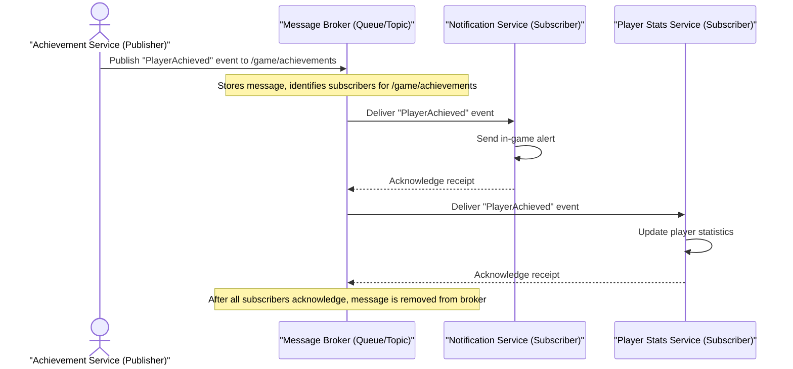

# Chapter 8: Message Queues / Pub/Sub

In our previous chapter, [Event-Driven Architecture](07_event_driven_architecture_.md), we learned a powerful way for different parts of our application to communicate using **events**. Instead of making direct calls, services just "announce" when something important has happened by publishing an event. Other services then "listen" for these events and react.

But how do these "announcements" actually travel from the service that publishes them (the producer) to all the services that need to hear them (the consumers)? What if a consumer service is temporarily busy or offline? What if the producer sends events much faster than the consumers can keep up? If events just get "shouted into the void," we might lose important information or overwhelm our services.

This is exactly the problem that **Message Queues** and **Pub/Sub (Publish/Subscribe) systems** solve! They act as the reliable "postal service" for our events, ensuring that messages get delivered safely and efficiently between different parts of our application.

## What are Message Queues and Pub/Sub?

At their core, both Message Queues and Pub/Sub systems provide a way to send messages between applications or services **asynchronously**. This means the sender doesn't have to wait for the receiver to process the message immediately. It just sends it and moves on.

Let's break down the concepts:

### 1. Message Queue

Imagine a literal waiting line (a queue) for messages.
*   When a service wants to send a message, it drops it into the queue.
*   The queue holds onto the message until a consumer service is ready to pick it up and process it.
*   Once a consumer successfully processes the message, it tells the queue, and the message is removed.
*   **Key Idea:** Typically, a message placed in a queue is processed by **only one** consumer. If you have multiple consumers reading from the same queue, they will share the workload, each taking a unique message.

### 2. Pub/Sub (Publish/Subscribe)

Pub/Sub is a messaging pattern that takes the idea of "announcements" even further.
*   **Topics:** Instead of a single queue, Pub/Sub uses "topics" or "channels." Think of these as different categories of announcements (e.g., "Quest Updates," "Player Achievements," "Shop Sales").
*   **Publishers:** A service that wants to send a message (publish an event) sends it to a specific *topic*. It doesn't know or care who is listening.
*   **Subscribers:** Services that are interested in certain types of messages "subscribe" to the relevant topics. When a message is published to that topic, *all* subscribers to that topic receive their own copy of the message.
*   **Key Idea:** A single message published to a topic can be delivered to **multiple** interested consumers.

Both Message Queues and Pub/Sub systems achieve a vital goal: they **decouple** the sender (producer/publisher) from the receiver (consumer/subscriber). This means they don't need to know details about each other, making our system more flexible and resilient.

Think of it like dropping a letter into a postbox (publishing) without knowing or caring who will read it. The postal service (the message queue/pub/sub system) ensures it reaches any interested recipient.

## Solving the "Cloud Adventure" Achievement Use Case

Let's revisit our "Cloud Adventure" game. When a player achieves something special, like "First Dragon Slain," many different services might need to react:
*   Send an in-game notification to the player.
*   Update the player's profile statistics.
*   Grant a special badge.
*   Log the achievement for analytics.

Instead of the `Achievement Service` directly calling all these other services (which can fail, just like we discussed in [Event-Driven Architecture](07_event_driven_architecture_.md)), we can use a Pub/Sub system.

1.  The `Achievement Service` (Publisher) publishes a `PlayerAchieved` event to a topic called `/game/achievements`.
2.  The `Notification Service` (Subscriber) is subscribed to `/game/achievements`.
3.  The `Player Stats Service` (Subscriber) is also subscribed to `/game/achievements`.
4.  The `Badge Granting Service` (Subscriber) is also subscribed to `/game/achievements`.
5.  The `Analytics Logger` (Subscriber) is also subscribed to `/game/achievements`.

When the `Achievement Service` publishes an event, the Pub/Sub system ensures all these interested services receive a copy.

### Conceptual Code: The Message Broker in Action

From our [Event-Driven Architecture](07_event_driven_architecture_.md) chapter, we had a conceptual `event_broker_conceptual.py`. Let's see how our services use it, understanding now that this conceptual broker *is* our message queue/pub-sub system.

First, our `Achievement Service` acts as the **Publisher**:

```python
# achievement_service_publisher.py
# Pretend this is our conceptual message broker system
_message_broker_queue = []

def publish_message(topic, message_payload):
    """
    Simulates publishing a message to a topic.
    The message broker (conceptual queue) stores it.
    """
    message_data = {"topic": topic, "payload": message_payload}
    _message_broker_queue.append(message_data)
    print(f"Achievement Service: Published to '{topic}': {message_payload['achievement_name']}")

def get_messages_for_subscribers(topic):
    """
    Simulates the message broker delivering messages to subscribers.
    Each subscriber would get a copy of messages for their subscribed topic.
    """
    # In a real system, this is handled automatically by the broker.
    # Here, we'll manually filter and return copies for demonstration.
    return [msg for msg in _message_broker_queue if msg["topic"] == topic]
```
The `Achievement Service` uses `publish_message` to send its event. It doesn't know who is listening, just which `topic` to send it to.

Now, our different services act as **Subscribers**, listening to the `/game/achievements` topic:

```python
# notification_service_subscriber.py
def handle_achievement_for_notification(message_payload):
    """Notification Service (Subscriber) reacts to a PlayerAchieved message."""
    player_id = message_payload["player_id"]
    achievement_name = message_payload["achievement_name"]
    print(f"  Notification Service: Sending in-game alert: '{player_id} earned {achievement_name}!'")

# player_stats_service_subscriber.py
def handle_achievement_for_stats(message_payload):
    """Player Stats Service (Subscriber) reacts to a PlayerAchieved message."""
    player_id = message_payload["player_id"]
    achievement_name = message_payload["achievement_name"]
    print(f"  Player Stats Service: Updating stats for {player_id} due to '{achievement_name}'.")

# badge_service_subscriber.py
def handle_achievement_for_badge(message_payload):
    """Badge Granting Service (Subscriber) reacts to a PlayerAchieved message."""
    player_id = message_payload["player_id"]
    achievement_name = message_payload["achievement_name"]
    print(f"  Badge Service: Granting '{achievement_name}' badge to {player_id}.")
```
Each subscriber has a simple function that knows how to process the `PlayerAchieved` message for its specific task.

Finally, let's see how it all comes together conceptually:

```python
# main_pubsub_simulation.py
from achievement_service_publisher import publish_message, get_messages_for_subscribers
from notification_service_subscriber import handle_achievement_for_notification
from player_stats_service_subscriber import handle_achievement_for_stats
from badge_service_subscriber import handle_achievement_for_badge

# Define our subscribers and the topic they listen to
subscribers_for_achievements = [
    handle_achievement_for_notification,
    handle_achievement_for_stats,
    handle_achievement_for_badge
]
achievement_topic = "/game/achievements"

# Simulate the Achievement Service publishing an event
player = "Hero_A"
achievement = "First Dragon Slain"
message = {"player_id": player, "achievement_name": achievement}

print(f"--- Player {player} earns achievement '{achievement}' ---")
publish_message(achievement_topic, message)
print(f"Achievement Service: Done its part, published event and moved on.")

# Simulate the message broker delivering messages to subscribers
# In a real Pub/Sub system, this delivery is automatic and continuous.
print("\n--- Message Broker is now distributing messages ---")
messages_from_broker = get_messages_for_subscribers(achievement_topic)

for msg in messages_from_broker:
    if msg["topic"] == achievement_topic:
        for subscriber_func in subscribers_for_achievements:
            subscriber_func(msg["payload"]) # Each subscriber processes the message

# In a real system, the broker would remove the message after all
# subscribed consumers have acknowledged receipt. For this simple demo,
# the underlying `_message_broker_queue` still holds it.

print("\n--- All relevant services have processed the achievement message. ---")

# Expected Output (order of subscriber processing might vary slightly):
# --- Player Hero_A earns achievement 'First Dragon Slain' ---
# Achievement Service: Published to '/game/achievements': First Dragon Slain
# Achievement Service: Done its part, published event and moved on.
#
# --- Message Broker is now distributing messages ---
#   Notification Service: Sending in-game alert: 'Hero_A earned First Dragon Slain!'
#   Player Stats Service: Updating stats for Hero_A due to 'First Dragon Slain'.
#   Badge Service: Granting 'First Dragon Slain' badge to Hero_A.
#
# --- All relevant services have processed the achievement message. ---
```
In this simulation, the `Achievement Service` just publishes its message and considers its job done. The conceptual "message broker" (represented by our simple Python list and functions) then makes sure that all registered subscribers for the `/game/achievements` topic receive and process the message independently. This ensures high **availability** (if one subscriber is down, others still work) and great **decoupling**.

## Under the Hood: Message Flow in Pub/Sub

Let's visualize how a message travels through a Pub/Sub system:


This diagram shows the `Achievement Service` publishing a message to the `Message Broker`. The `Message Broker` then acts as a central hub, delivering copies of that message to all interested subscribers (`Notification Service` and `Player Stats Service`). Each subscriber processes the message independently and acknowledges its completion back to the broker.

## Why Use Message Queues / Pub/Sub?

| Feature              | Without MQ/PubSub (Direct Calls)                             | With Message Queues / Pub/Sub                            |
| :------------------- | :----------------------------------------------------------- | :------------------------------------------------------- |
| **Coupling**         | **Tight Coupling:** Publisher knows specific receivers, depends on them. | **Loose Coupling:** Publisher doesn't know receivers; receivers don't know publisher. |
| **Asynchronous Comm.** | Often synchronous; sender waits for receiver.                | Inherently asynchronous; sender doesn't wait.            |
| **Scalability**      | Harder to scale individual parts if tightly linked.          | Highly scalable; add more consumers as needed for specific tasks. |
| **Resilience**       | If a receiver is down, the sender might fail or block.       | If a consumer is down, messages wait in the queue/topic until it recovers. Other consumers still process. |
| **Load Leveling**    | Sudden spikes in requests can overwhelm receivers.           | Queue buffers requests, allowing consumers to process at their own pace. |
| **Flexibility**      | Adding new features (new receivers) requires changing sender code. | Easy to add new subscribers without changing the publisher. |

## Conclusion

Message Queues and Pub/Sub systems are fundamental components in modern distributed architectures. They provide a robust and flexible way to achieve **decoupling** and **asynchronous communication** between services, greatly enhancing your application's **scalability**, **resilience**, and **flexibility**. By understanding how publishers send messages to topics/queues and how subscribers consume them, you gain a powerful tool for building highly efficient and robust systems, like our "Cloud Adventure" game.

Next, we'll explore another critical technique for improving application performance and reducing load on backend services: [Caching](09_caching_.md)!
