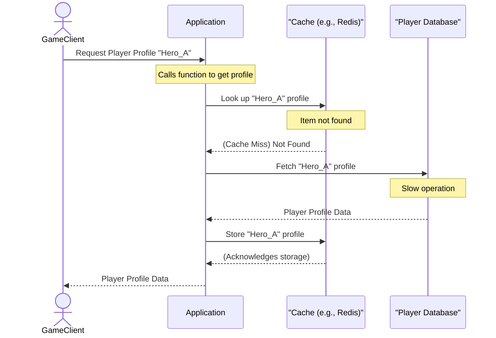
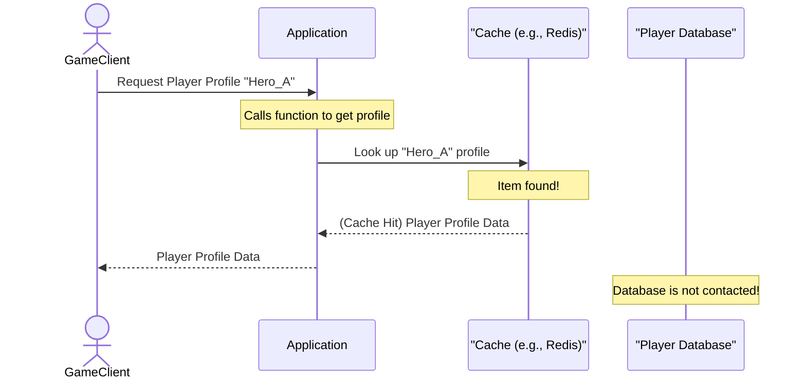

# Chapter 9: Caching

In our last chapter, [Message Queues / Pub/Sub](08_message_queues___pub_sub_.md), we learned how to build robust and decoupled communication systems using events. Services publish messages, and others subscribe, ensuring reliable delivery even if some services are temporarily unavailable. This is great for handling *what* happens in our "Cloud Adventure" game. But what about getting *information* quickly?

Imagine your "Cloud Adventure" game is immensely popular, and millions of players are constantly logging in, checking their profiles, viewing their inventory, or seeing their character's stats. All this information usually lives in a **database**, which is great for storing data safely and reliably.

However, databases can be **slow** compared to your application's memory. If every single request for a player's profile goes directly to the database, especially during peak hours, the database can get overwhelmed. This leads to slow loading times for players, increased costs for database resources, and potentially even system crashes. It's like having a brilliant librarian (your database) but a very, very long line of people asking for the same few popular books over and over again.

How can we speed up access to frequently requested data and reduce the load on our backend systems? The answer is **Caching**.

## What is Caching?

**Caching** is like having a small notepad on your desk where you write down frequently needed phone numbers instead of looking them up in a large directory (your database) every single time. It saves time and effort because getting information from the notepad is much faster than searching the big directory.

In software, caching means storing copies of frequently accessed or expensive-to-compute data in a **faster-access layer**, typically closer to the user or application. This way, when the data is requested again, your application can grab it from the fast cache instead of going all the way to the slower, main source (like a database or an external service).

### Key Ideas in Caching

1.  **Cache Layer:** This is the fast-access storage where data copies are kept. It can be:
    *   **In-Memory Cache:** The fastest type, where data is stored directly in the application's RAM (Random Access Memory). Think of it as your brain remembering a fact.
    *   **Distributed Cache:** A separate, specialized service (like Redis or Memcached) that runs on its own servers and can be shared by many applications. This is like a shared whiteboard in your office where everyone writes down important, common information. This is useful for [Horizontal Scaling](01_scalability_.md), as multiple instances of your game can use the same cache.
    *   **CDN (Content Delivery Network):** For static content (like images, videos, game assets), CDNs cache these files in servers located all over the world, closer to your players. (This is listed as a [Building Block](README.md#building-blocks-short-descriptions) in our `awesome-architect` guide).

2.  **Cache Hit:** This happens when your application looks for data in the cache, and it finds it there. Great! You get the data quickly.

3.  **Cache Miss:** This happens when your application looks for data in the cache, but it's *not* there. Uh oh! The application then has to go to the original, slower source (like the database) to get the data. After fetching it, it usually stores a copy in the cache for future requests.

4.  **Cache Invalidation:** This is the trickiest part of caching. What happens if the original data changes (e.g., a player levels up)? The copy in the cache becomes **stale** (outdated). You need a strategy to remove or update stale data in the cache. Common strategies include:
    *   **Time-to-Live (TTL):** Each cached item has an expiry time. After this time, the item is automatically removed from the cache.
    *   **Manual Invalidation:** When the original data changes, your application explicitly tells the cache to remove or update that specific item.

## Solving the "Cloud Adventure" Player Profile Use Case with Caching

Let's use our "Cloud Adventure" game. Players frequently check their profile to see their name, level, class, and perhaps some recent stats. This information usually comes from a database.

First, let's simulate a slow database call:

```python
import time

def get_player_profile_from_database(player_id):
    """Simulates fetching a player profile from a slow database."""
    print(f"  (Database): Fetching profile for {player_id}...")
    time.sleep(0.5)  # Simulate network latency and database processing time
    return {"id": player_id, "name": f"Player_{player_id}", "level": 10, "class": "Warrior"}

# Simulating a direct, slow call:
print("--- Without Caching (Direct DB Call) ---")
profile = get_player_profile_from_database("Hero_A")
print(f"Retrieved: {profile}\n")
```
This conceptual `get_player_profile_from_database` function simulates a database call, which takes `0.5` seconds. If thousands of players make such calls simultaneously, your database will quickly become overloaded.

Now, let's introduce a simple in-memory cache to speed things up:

```python
# Our simple in-memory cache (a Python dictionary)
_player_cache = {}

def get_player_profile_with_cache(player_id):
    """
    Fetches a player profile, checking the cache first.
    If not in cache, fetches from DB and stores in cache.
    """
    print(f"Requesting profile for {player_id}...")

    # 1. Check the cache first (Cache Hit attempt)
    if player_id in _player_cache:
        print(f"  (Cache): Cache Hit! Returning profile for {player_id}.")
        return _player_cache[player_id]

    # 2. If not in cache (Cache Miss), go to the slow source
    print(f"  (Cache): Cache Miss. Fetching from database...")
    profile = get_player_profile_from_database(player_id)

    # 3. Store the fetched data in the cache for next time
    _player_cache[player_id] = profile
    print(f"  (Cache): Stored profile for {player_id} in cache.")
    return profile

print("--- With Caching ---")
# First request: will be a Cache Miss
profile_1 = get_player_profile_with_cache("Hero_A")
print(f"First request result: {profile_1}")

# Second request for the same player: will be a Cache Hit!
profile_2 = get_player_profile_with_cache("Hero_A")
print(f"Second request result: {profile_2}")

# Request for a different player: Cache Miss again
profile_3 = get_player_profile_with_cache("Hero_B")
print(f"Third request (new player) result: {profile_3}")

# Expected Output:
# --- Without Caching (Direct DB Call) ---
#   (Database): Fetching profile for Hero_A...
# Retrieved: {'id': 'Hero_A', 'name': 'Player_Hero_A', 'level': 10, 'class': 'Warrior'}
#
# --- With Caching ---
# Requesting profile for Hero_A...
#   (Cache): Cache Miss. Fetching from database...
#   (Database): Fetching profile for Hero_A...
#   (Cache): Stored profile for Hero_A in cache.
# First request result: {'id': 'Hero_A', 'name': 'Player_Hero_A', 'level': 10, 'class': 'Warrior'}
# Requesting profile for Hero_A...
#   (Cache): Cache Hit! Returning profile for Hero_A.
# Second request result: {'id': 'Hero_A', 'name': 'Player_Hero_A', 'level': 10, 'class': 'Warrior'}
# Requesting profile for Hero_B...
#   (Cache): Cache Miss. Fetching from database...
#   (Database): Fetching profile for Hero_B...
#   (Cache): Stored profile for Hero_B in cache.
# Third request (new player) result: {'id': 'Hero_B', 'name': 'Player_Hero_B', 'level': 10, 'class': 'Warrior'}
```
As you can see, the second request for "Hero_A" was much faster because it was a **cache hit**! The application didn't have to wait for the slow database at all. This simple example demonstrates how caching can dramatically improve performance for frequently accessed data.

## Under the Hood: How Caching Works

Let's visualize the steps involved when an application tries to get data, first with a cache miss, then with a cache hit.

### Scenario 1: Cache Miss (First Request)


When the `GameClient` first requests a profile, the `Application` checks the `Cache`. Since it's the first request, the item isn't there (a `Cache Miss`). The `Application` then goes to the `Database` (the slow source), retrieves the data, and crucially, stores a copy in the `Cache` before sending it back to the `GameClient`.

### Scenario 2: Cache Hit (Subsequent Request)


For a subsequent request for the same profile, the `Application` checks the `Cache` again. This time, the data is found (a `Cache Hit`!). The `Cache` immediately returns the data to the `Application`, which sends it to the `GameClient`. The `Database` is completely skipped, making the operation much faster and reducing the load on the database.

## Cache Invalidation: Keeping Data Fresh

A crucial part of caching is ensuring the data in the cache doesn't become too old or **stale**. If "Hero_A" levels up, the cache should ideally reflect this change quickly.

Here's how we might conceptually handle cache invalidation, for example, when a player's level changes:

```python
_player_cache_with_ttl = {} # Our cache storage
_cache_ttl_seconds = 10 # Data expires after 10 seconds

def get_player_profile_with_ttl_cache(player_id):
    """Fetches profile, includes basic TTL (Time-To-Live) logic."""
    current_time = time.time()
    cached_item = _player_cache_with_ttl.get(player_id)

    # Check if item exists and is not expired
    if cached_item and (current_time - cached_item["timestamp"] < _cache_ttl_seconds):
        print(f"  (Cache TTL): Cache Hit (fresh)! Returning profile for {player_id}.")
        return cached_item["data"]

    print(f"  (Cache TTL): Cache Miss or Expired. Fetching from database...")
    profile = get_player_profile_from_database(player_id) # Still uses the slow DB call

    # Store with current timestamp
    _player_cache_with_ttl[player_id] = {"data": profile, "timestamp": current_time}
    print(f"  (Cache TTL): Stored/refreshed profile for {player_id} in cache.")
    return profile

def update_player_level(player_id, new_level):
    """Simulates updating player level and manually invalidating cache."""
    print(f"\n--- Updating player {player_id}'s level to {new_level} ---")
    # Simulate database update
    # In a real app, this would update the actual DB.
    # We'll just print it for this conceptual demo.
    print(f"  (Database): Updated {player_id}'s level to {new_level} in DB.")

    # Invalidate the cache for this player
    if player_id in _player_cache_with_ttl:
        del _player_cache_with_ttl[player_id]
        print(f"  (Cache): Manually invalidated cache for {player_id}.")

# Simulate getting profile, then updating level, then getting again
print("\n--- Caching with TTL and Manual Invalidation ---")
get_player_profile_with_ttl_cache("Hero_C") # Initial cache miss
time.sleep(1)
get_player_profile_with_ttl_cache("Hero_C") # Cache hit

update_player_level("Hero_C", 11) # Change data, invalidate cache

get_player_profile_with_ttl_cache("Hero_C") # Will be a cache miss again, fetching new data

# Expected Output:
# --- Caching with TTL and Manual Invalidation ---
#   (Cache TTL): Cache Miss or Expired. Fetching from database...
#   (Database): Fetching profile for Hero_C...
#   (Cache TTL): Stored/refreshed profile for Hero_C in cache.
#   (Cache TTL): Cache Hit (fresh)! Returning profile for Hero_C.
#
# --- Updating player Hero_C's level to 11 ---
#   (Database): Updated Hero_C's level to 11 in DB.
#   (Cache): Manually invalidated cache for Hero_C.
#   (Cache TTL): Cache Miss or Expired. Fetching from database...
#   (Database): Fetching profile for Hero_C...
#   (Cache TTL): Stored/refreshed profile for Hero_C in cache.
```
In this example, we show two ways to handle staleness:
1.  **TTL:** The cache automatically expires after `_cache_ttl_seconds`.
2.  **Manual Invalidation:** When `update_player_level` is called, it explicitly removes the player's profile from the cache using `del _player_cache_with_ttl[player_id]`. This ensures the next request will fetch the newest data from the database.

## Why Use Caching?

| Feature            | Without Caching                               | With Caching                                     |
| :----------------- | :-------------------------------------------- | :----------------------------------------------- |
| **Performance**    | Slower response times due to constant access to primary data source. | Significantly faster response times, especially for read-heavy data. |
| **Backend Load**   | High load on databases/backend services.      | Reduced load on databases/backend services, allowing them to handle more writes or complex queries. |
| **Cost**           | Potentially higher costs for powerful databases. | Can reduce infrastructure costs by offloading work from expensive databases. |
| **User Experience**| Laggy or slow interactions.                   | Snappier, more responsive application.           |
| **Complexity**     | Simpler system design.                        | Adds complexity (managing cache, invalidation).  |
| **Data Freshness** | Always real-time data.                        | Risk of serving **stale data** if invalidation isn't handled correctly. |

## Conclusion

Caching is a powerful and essential technique for building high-performance, scalable applications like our "Cloud Adventure" game. By storing copies of frequently accessed data in a fast-access layer, you can dramatically improve response times, reduce the load on your primary data sources, and ultimately provide a much better experience for your users. While the challenge of keeping cached data fresh (cache invalidation) adds some complexity, the benefits often far outweigh the drawbacks for read-heavy workloads.

As your application grows and you implement various [Scalability](01_scalability_.md) and [Microservices Architecture](03_microservices_architecture_.md) patterns, you'll need ways to distribute incoming user requests evenly across many application servers. That's exactly what we'll explore in our next chapter: [Load Balancing](10_load_balancing_.md)!
