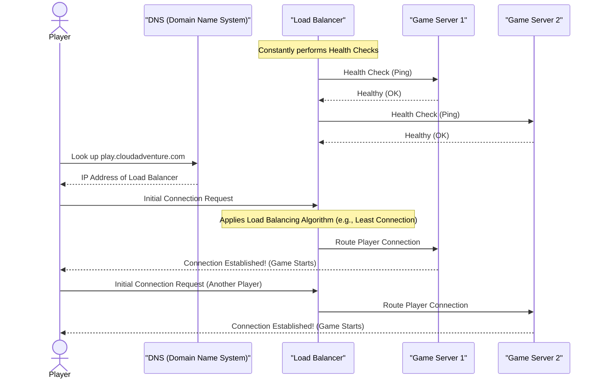

# Chapter 10: Load Balancing

In our last chapter, [Caching](09_caching_.md), we learned how to speed up access to frequently requested data and reduce the load on individual services by storing copies closer to the user. This is fantastic for making a single server more efficient. But what happens when our "Cloud Adventure" game becomes so popular that even with caching, a single server simply can't handle all the incoming players and requests?

We talked about [Horizontal Scaling](01_scalability_.md) – adding more servers to handle more work. Imagine you have built out a powerful army of 10, 20, or even 100 identical game servers, each ready to serve players. Now, here's the crucial question: when a new player tries to connect to `play.cloudadventure.com`, how do you decide *which* of those 100 available servers they should connect to?

If you just send everyone to the first server, it will get overwhelmed. If one server suddenly crashes, players trying to connect to it won't be able to play. This is where **Load Balancing** comes in.

## What is Load Balancing?

**Load balancing** is like having a super-smart traffic cop or a restaurant host for your application. Its job is to efficiently distribute incoming network traffic (like new players trying to connect) across multiple servers or resources that are all doing the same job (like your game servers).

The main goals of load balancing are:
*   **Prevent Overload:** Ensure no single server gets overwhelmed by too many requests, which could slow it down or crash it.
*   **Improve Availability:** If one server fails, the load balancer can automatically redirect traffic to the healthy servers, so players don't even notice a problem.
*   **Increase Responsiveness:** By spreading the workload, each server can respond faster, leading to a smoother experience for users.
*   **Enhance Scalability:** It's a critical component for effectively using [Horizontal Scaling](01_scalability_.md).

Think of a popular restaurant with multiple chefs in the kitchen. The host (the load balancer) doesn't just send every new customer to the first chef they see. Instead, they quickly check which chef is least busy or most ready for a new order, and then direct the customer to that chef. This keeps all chefs working efficiently and ensures every customer gets served without undue delay.

## Key Concepts of Load Balancing

To understand how load balancing works, let's look at its core components and functions:

1.  **The Load Balancer:** This is a dedicated piece of hardware or software that sits in front of your group of servers. All incoming client requests first hit the load balancer.
2.  **Backend Servers (or Server Pool):** This is the group of actual application servers (e.g., your "Cloud Adventure" game servers) that handle the requests and perform the work. The load balancer distributes traffic among these servers.
3.  **Health Checks:** The load balancer constantly monitors the health and availability of each backend server. It periodically pings them or tries to connect to ensure they are running correctly and can accept new traffic. If a server fails a health check, the load balancer stops sending new requests to it until it recovers.
4.  **Load Balancing Algorithms:** These are the rules or strategies the load balancer uses to decide which backend server should receive the next incoming request. Some common ones include:
    *   **Round Robin:** Simply sends requests to each server in the pool in a sequential, rotating order. (Server 1, then Server 2, then Server 3, then Server 1 again, etc.). This is like dealing cards evenly.
    *   **Least Connection:** Directs new requests to the server that currently has the fewest active connections. This is often more effective than Round Robin because it accounts for servers that might be handling longer-running tasks. (Our restaurant host checking who's truly least busy).
    *   **Weighted Round Robin/Least Connection:** If some servers are more powerful or have more capacity than others, you can assign them a "weight." More powerful servers will receive a larger proportion of the traffic.

## Solving the "Cloud Adventure" New Player Connection Use Case with Load Balancing

Let's see how load balancing ensures new players are efficiently connected to our "Cloud Adventure" game.

Imagine we have three game servers: `GameServer1`, `GameServer2`, `GameServer3`.
The **Load Balancer** sits in front of them. When a player connects to `play.cloudadventure.com`:

1.  The player's device sends a connection request to `play.cloudadventure.com`.
2.  The Domain Name System (DNS) resolves `play.cloudadventure.com` to the IP address of the **Load Balancer**.
3.  The Load Balancer receives the connection request.
4.  Based on its chosen algorithm (e.g., Least Connection) and ongoing health checks, it selects the best available `GameServer` (e.g., `GameServer2`).
5.  The Load Balancer forwards the player's connection request to `GameServer2`.
6.  `GameServer2` establishes the connection with the player, and they start playing!

Let's simulate this with some simple Python code, focusing on the `Least Connection` algorithm.

```python
class GameServer:
    def __init__(self, id, max_connections=10):
        self.id = id
        self.active_connections = 0
        self.is_healthy = True
        self.max_connections = max_connections

    def connect_player(self):
        if not self.is_healthy or self.active_connections >= self.max_connections:
            return False
        self.active_connections += 1
        return True

    def disconnect_player(self):
        if self.active_connections > 0:
            self.active_connections -= 1

    def __str__(self):
        return f"Server {self.id} (Conn: {self.active_connections}/{self.max_connections}, Healthy: {self.is_healthy})"

class LoadBalancer:
    def __init__(self, servers):
        self.servers = servers

    def choose_server(self, algorithm="least_connection"):
        healthy_servers = [s for s in self.servers if s.is_healthy and s.active_connections < s.max_connections]

        if not healthy_servers:
            print("  Load Balancer: No healthy servers available!")
            return None

        if algorithm == "least_connection":
            # Pick the server with the fewest active connections
            return min(healthy_servers, key=lambda s: s.active_connections)
        elif algorithm == "round_robin":
            # (Simplified for demo) This would need state to track last server
            return healthy_servers[0] # Just picks first for this simple demo
        else:
            return None

    def distribute_connection(self):
        chosen_server = self.choose_server()
        if chosen_server:
            if chosen_server.connect_player():
                print(f"  Load Balancer: Redirected connection to {chosen_server.id}.")
                return True
        return False

# Setup our game servers
game_servers = [
    GameServer("A", max_connections=5),
    GameServer("B", max_connections=5),
    GameServer("C", max_connections=5)
]

# Create our load balancer
load_balancer = LoadBalancer(game_servers)

print("--- Simulating New Player Connections ---")
for i in range(10): # Simulate 10 new players connecting
    print(f"\nPlayer {i+1} trying to connect:")
    if not load_balancer.distribute_connection():
        print(f"  Player {i+1} failed to connect (all servers busy or down).")
    for server in game_servers:
        print(f"  {server}")

# Output will vary slightly based on server capacity and connection distribution
# Example Output (conceptual, actual might differ slightly):
# --- Simulating New Player Connections ---
#
# Player 1 trying to connect:
#   Load Balancer: Redirected connection to Server A.
#   Server A (Conn: 1/5, Healthy: True)
#   Server B (Conn: 0/5, Healthy: True)
#   Server C (Conn: 0/5, Healthy: True)
#
# Player 2 trying to connect:
#   Load Balancer: Redirected connection to Server B.
#   Server A (Conn: 1/5, Healthy: True)
#   Server B (Conn: 1/5, Healthy: True)
#   Server C (Conn: 0/5, Healthy: True)
#
# Player 3 trying to connect:
#   Load Balancer: Redirected connection to Server C.
#   Server A (Conn: 1/5, Healthy: True)
#   Server B (Conn: 1/5, Healthy: True)
#   Server C (Conn: 1/5, Healthy: True)
#
# Player 4 trying to connect:
#   Load Balancer: Redirected connection to Server A.
#   Server A (Conn: 2/5, Healthy: True)
#   Server B (Conn: 1/5, Healthy: True)
#   Server C (Conn: 1/5, Healthy: True)
#
# ... (continues distributing connections evenly) ...
#
# Player 10 trying to connect:
#   Load Balancer: Redirected connection to Server A.
#   Server A (Conn: 4/5, Healthy: True)
#   Server B (Conn: 3/5, Healthy: True)
#   Server C (Conn: 3/5, Healthy: True)
```
In this simplified example, the `LoadBalancer` class manages a list of `GameServer` instances. When `distribute_connection()` is called, it uses the `least_connection` algorithm to find the server with the fewest players (active connections) and directs the new player there. You can see how the connections are spread out, preventing any one server from being overloaded too quickly.

## Under the Hood: The Load Balancing Flow

Let's visualize the steps involved when a player connects to "Cloud Adventure" through a load balancer:


This diagram illustrates the full flow. The `Player` first uses `DNS` to find the `LoadBalancer`. The `LoadBalancer` continuously checks the health of `GameServer1` and `GameServer2`. When `Player` sends a connection request, the `LoadBalancer` chooses an available server (e.g., `GameServer1` for the first player, `GameServer2` for the second) and routes the traffic. The player then communicates directly with the chosen game server.

## Why Use Load Balancing?

Load balancing is a foundational component for any scalable, reliable application.

| Feature            | Without Load Balancing                               | With Load Balancing                                   |
| :----------------- | :--------------------------------------------------- | :---------------------------------------------------- |
| **Scalability**    | Limited to the capacity of a single server.           | Enables [Horizontal Scaling](01_scalability_.md) by distributing traffic across many servers. |
| **Availability**   | Single point of failure (if the server crashes, app is down). | High availability; traffic is automatically routed away from unhealthy servers. |
| **Performance**    | Server can get overloaded, leading to slow responses or crashes. | Distributes load, ensures optimal performance across all servers. |
| **Reliability**    | Prone to outages from server failures or spikes in traffic. | More resilient; can handle server failures gracefully and absorb traffic spikes. |
| **Maintenance**    | Harder to take servers offline for updates without downtime. | Can gracefully remove servers for maintenance/updates without affecting users. |
| **Resource Usage** | Inefficient if one server is busy and others are idle. | Optimizes resource utilization across the server pool. |

## Conclusion

Load balancing is an indispensable technique for building robust, high-performance, and scalable applications like "Cloud Adventure." By intelligently distributing incoming network traffic across multiple servers, it ensures no single server becomes a bottleneck, vastly improves the application's availability and responsiveness, and is a cornerstone for effective [Horizontal Scaling](01_scalability_.md). It works in conjunction with other patterns, often sitting in front of a cluster of application servers, potentially including components from a [Microservices Architecture](03_microservices_architecture_.md) or acting as the entry point before an [API Gateway](04_api_gateway_.md). Understanding load balancing is key to designing systems that can handle real-world user demand.
