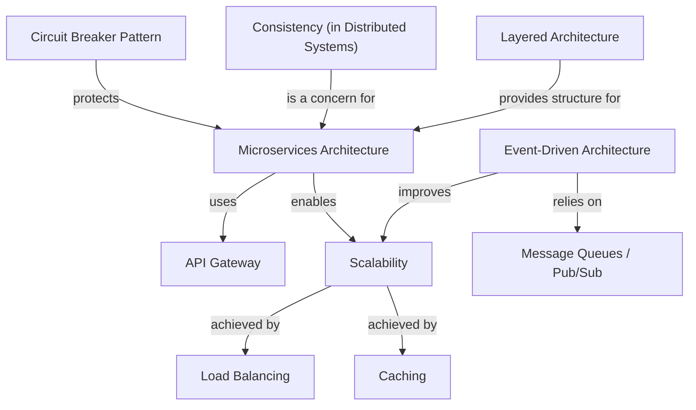

# Awesome Architect

Curated list of items each architect should be aware of along with a short description.

# Tutorial: awesome-architect

This project is a **curated list** of essential architectural patterns and concepts designed to help software architects. It provides *short descriptions* for various approaches, from organizing application components (like **Microservices**) to handling large user loads (**Scalability**), ensuring reliable communication (**Event-Driven Architecture**), and improving system performance (**Caching** and **Load Balancing**).

## Visual Overview

## Chapters

1. [Scalability
](01_scalability_.md)
2. [Layered Architecture
](02_layered_architecture_.md)
3. [Microservices Architecture
](03_microservices_architecture_.md)
4. [API Gateway
](04_api_gateway_.md)
5. [Circuit Breaker Pattern
](05_circuit_breaker_pattern_.md)
6. [Consistency (in Distributed Systems)
](06_consistency__in_distributed_systems__.md)
7. [Event-Driven Architecture
](07_event_driven_architecture_.md)
8. [Message Queues / Pub/Sub
](08_message_queues___pub_sub_.md)
9. [Caching
](09_caching_.md)
10. [Load Balancing
](10_load_balancing_.md)

---

Generated by [AI Codebase Knowledge Builder](https://github.com/The-Pocket/Tutorial-Codebase-Knowledge).

## Client Architecture Patterns
1. MVC (Model View Controller) — Separates application into Model (data), View (UI), and Controller (input/business logic) to organize code and improve testability.
2. MVP (Model View Presenter) — Similar to MVC but the Presenter handles presentation logic and interacts with the View via an interface, improving testability of UI logic.
3. MVVM (Model View ViewModel) — Introduces a ViewModel that exposes data and commands for the View; commonly used with data binding for clear separation.
4. MVVMC (Model View ViewModel Coordinator) — MVVM with a Coordinator (or Router) to handle navigation and decouple flow logic from ViewModels.
5. VIPER (View Interactor Presenter Entity Router) — Highly modular pattern (View, Interactor for business rules, Presenter, Entities, Router) used for strict separation of concerns.

## Distributed Design Patterns
1. Circuit Breaker — Protects services from repeated failures by stopping requests to a failing component and allowing recovery checks.
2. CQRS (Command Query Responsibility Segregation) — Separates read and write models to optimize performance and scalability for different workloads.
3. Event Sourcing — Persist application state as a sequence of events, enabling auditability, replay, and complex state reconstruction.
4. Leader Election — Mechanism to choose a coordinating node among distributed nodes for tasks requiring a single leader.
5. Ambassador — An intermediary proxy that handles networking concerns (e.g., retries, timeouts) for services without changing the service code.
6. Pub/Sub — Publish/Subscribe messaging: decouples producers and consumers via topics so components can communicate asynchronously.
7. Sharding — Partitioning data across multiple nodes to scale reads/writes and storage horizontally.
8. Strangler Fig Pattern — Gradually replace parts of a monolith by routing functionality to new services until the monolith can be retired.

## Architecture Patterns
1. Layered Architecture / Pattern — Organize system into layers (presentation, business, data) with defined responsibilities and dependencies.
2. Event Driven Architecture — Components communicate by emitting and reacting to events, enabling loose coupling and better scalability.
3. Microkernel Architecture — Core system provides minimal functionality and plugins/extensions add specialized features.
4. Microservices Architecture — Small, autonomous services that communicate over network APIs to build a larger system; favors independent deployment and scaling.
5. Monolith (Modular Monolith) — Single deployable application organized into internal modules; simpler to develop but can be harder to scale independently.

## Deployment Strategies
1. Big Bang Deployment — Deploy everything at once (simple but risky for large changes).
2. Rolling Deployment — Replace instances incrementally to reduce downtime and risk.
3. Blue-green Deployment — Maintain two identical environments (blue and green) and switch traffic between them for near-zero downtime rollouts.
4. Canary Deployment — Release changes to a small subset of users first to monitor behavior before wider rollout.
5. Feature Toggle Deployment — Use feature flags to enable/disable features in production allowing safe rollout and A/B testing.

📌 KEY CONCEPTS (short notes):
- Scalability — Ability of a system to handle increased load by scaling vertically or horizontally.
- Availability — The proportion of time a system is operational and accessible to users.
- CAP Theorem — In distributed systems you can only have two of Consistency, Availability, and Partition tolerance.
- ACID Transactions — Set of database guarantees (Atomicity, Consistency, Isolation, Durability) for reliable updates.
- Consistent Hashing — Distributes keys across nodes to minimize remapping when nodes join/leave.
- Rate Limiting — Controls incoming request rates to protect services from overload.
- API Design — Principles for designing stable, discoverable, and versionable interfaces.
- Fault Tolerance — Ability to continue operation in the presence of faults.
- Consensus Algorithms — Protocols (e.g., Raft, Paxos) to agree on values across unreliable networks.
- Gossip Protocol — Peer-to-peer communication protocol for quickly sharing state in large clusters.
- Service Discovery — Mechanism for services to find each other (DNS, registries).
- Disaster Recovery — Strategies and backups to recover from catastrophic failures.
- Distributed Tracing — Track requests across services to diagnose performance issues.

⚖️ TRADEOFFS (very brief):
- REST vs RPC — REST favors standard HTTP semantics and broad compatibility; RPC can be more efficient and expressive.
- Vertical vs Horizontal Scaling — Vertical is simpler but constrained by single node limits; horizontal scales better but adds complexity.
- Stateful vs Stateless Design — Stateless services are easier to scale; stateful services require coordination for consistency.
- Strong vs Eventual Consistency — Strong gives immediate correctness; eventual improves availability and performance at the cost of temporary divergence.
- Push vs Pull Architecture — Push delivers updates immediately; pull reduces unnecessary work but increases latency for consumers.
- Latency vs Throughput — Optimizing for low latency can reduce throughput and vice versa; balance depends on use case.
- Long-polling vs WebSockets — Long-polling works over plain HTTP; WebSockets provide full-duplex low-latency channels.
- Batch vs Stream Processing — Batch is simpler for large datasets; stream is better for real-time, low-latency processing.
- Read-Through vs Write-Through Cache — Read-through loads cache on miss; write-through updates cache synchronously with DB.
- Synchronous vs Asynchronous Communications — Sync is easier to reason about; async improves resilience and scalability.

🛠️ BUILDING BLOCKS (short descriptions):
- Caching — Store computed or frequently accessed data to reduce load and latency.
- Distributed Caching — Shared caches across nodes to scale read-heavy workloads.
- Database Types — Relational, key-value, document, columnar, graph; choose by data and access patterns.
- Load Balancing — Distribute requests across instances for availability and utilization.
- SQL vs NoSQL — SQL offers strong schemas and transactions; NoSQL offers flexibility and horizontal scale.
- Database Indexes — Structures to speed query lookups at the cost of write overhead.
- CDN (Content Delivery Network) — Cache and serve static content from edge locations to reduce latency.
- DNS — Naming system to translate domain names to IP addresses and support service discovery.
- Consistency Patterns — Techniques (e.g., leader-based, quorum) to maintain data correctness across replicas.
- Heartbeats — Periodic signals to detect node liveness.
- Circuit Breaker — Prevents cascading failures by stopping calls to failing components.
- Idempotency — Making operations repeatable without different effects, important for retries.
- Database Scaling — Vertical vs horizontal strategies; replication and sharding.
- Data Replication — Copying data across nodes for durability and read scaling.
- Data Redundancy — Storing duplicates to tolerate failures.
- Database Sharding — Partitioning data to distribute load.
- Database Architectures — Architecting for OLTP vs OLAP, single vs multi-region.
- Failover — Automatic switching to standby resources when primary fails.
- Proxy Server — Intermediate layer for routing, caching, security and request shaping.
- Message Queues — Buffering and reliable delivery for asynchronous processing.
- Checksums — Verifying data integrity during transfer or storage.
- WebSockets — Bidirectional protocol for low-latency communication.
- Bloom Filters — Probabilistic data structure for set membership with space efficiency.
- API Gateway — Central entry point for APIs providing routing, auth, rate-limiting.
- Microservices Guidelines — Best practices (bounded context, observability, contracts, CI/CD).
- Distributed Locking — Coordination primitive for exclusive access across nodes.

🖇️ ARCHITECTURAL PATTERNS (reminder):
- Client-Server Architecture — Clients request services from centralized servers.
- Microservices Architecture — See above (small services, independent deploys).
- Serverless Architecture — Run code in ephemeral functions managed by cloud provider; good for event-driven workloads.
- Event-Driven Architecture — See above (events drive interactions).
- Peer-to-Peer (P2P) Architecture — Nodes communicate directly without central coordination; useful for decentralized systems.
